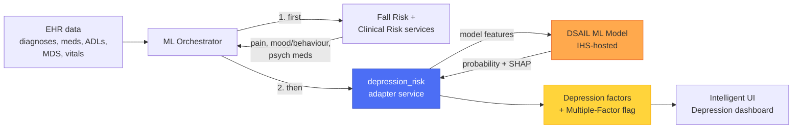
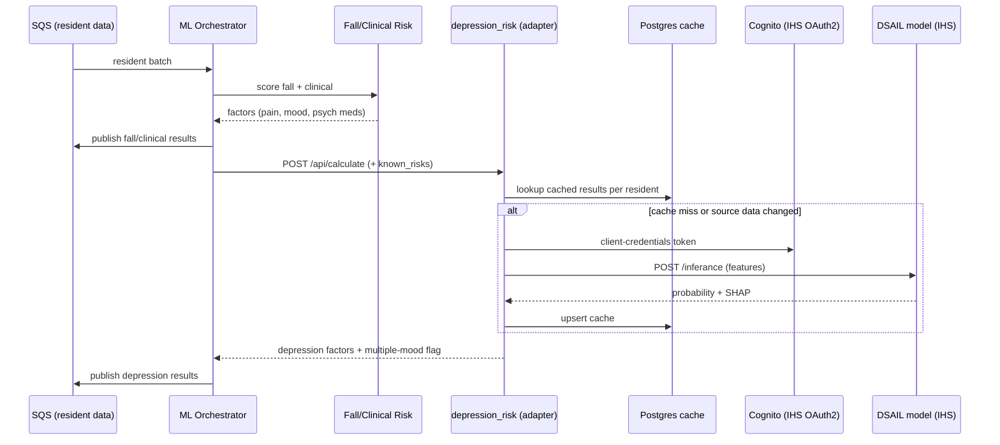
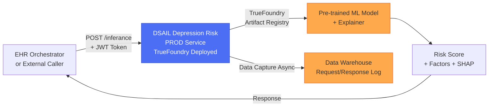
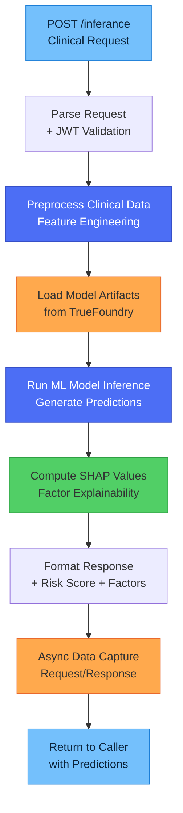
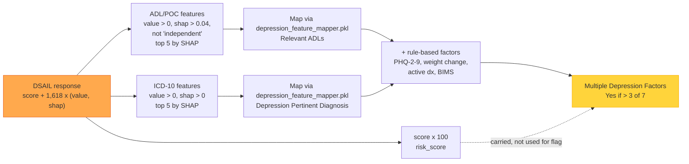
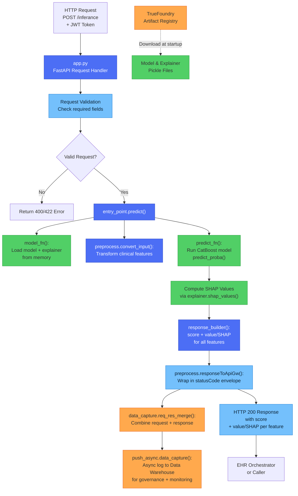
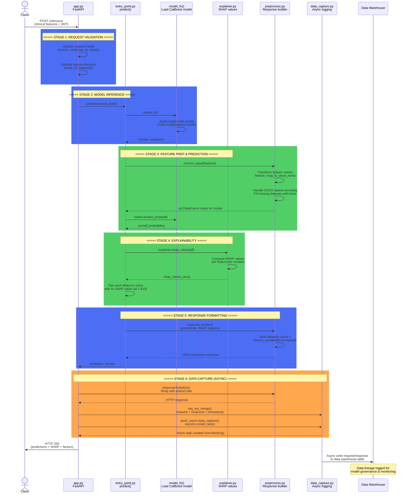
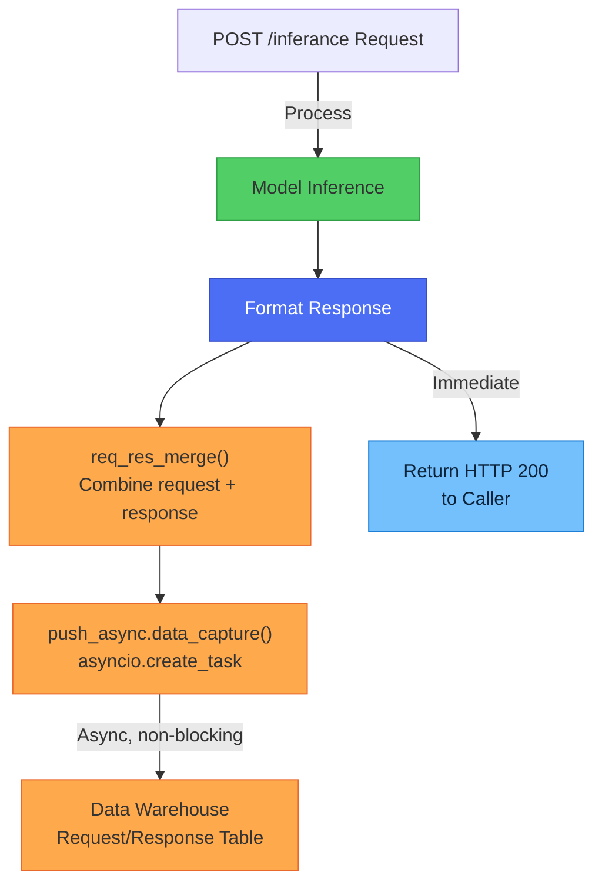

# Depression Risk Service Documentation (DSAIL PROD Deployment)

> **Repository:** [`dsail-depression-risk`](https://github.com/resmed/dsail-depression-risk) (prod branch); mirrored in this monorepo on `main` at `services/ml_services/dsail-depression-risk/` · **Deployment:** TrueFoundry · **Framework:** FastAPI · **Python 3.9** · **ML Model:** CatBoost gradient-boosted trees (model version `2023-12-05`), artifact-registered · **Data Capture:** Enabled

## Project Introduction

> **Scope:**
> - `services/ml_services/depression_risk` — the rcs-ehr-cai adapter service;
> - the DSAIL model service (`dsail-depression-risk`, mirrored at `services/ml_services/dsail-depression-risk/` on `main`);
> - `ml_orchestrator` (caller);
> - `clinical_backend` / `intelligent-ui` (presentation);
> - `helm-values/depression_risk`.
>
> **As of:** 2026-10-01. Facts come from repository code and configuration. Items marked **[TBD]** are not available in the repository.

### Summary

- **What it is:** A capability that helps nursing staff identify residents who may be developing **depression**, so screening and intervention can happen earlier. It produces a resident-level **"Multiple Depression Factors"** flag with supporting evidence: pertinent diagnoses, ADL changes, PHQ-2-to-9 score, weight change, pain, mood/behaviour, and psychotropic medications.
- **Two-part design:**
 1. **DSAIL ML model.** A **CatBoost gradient-boosted decision tree classifier**, model version **2023-12-05**. It is trained and hosted by the DSAIL team on the IHS platform. It returns a depression-risk probability plus SHAP values over 1,618 features.
 2. **rcs-ehr-cai `depression_risk` service.** An adapter that:
    - turns EHR data into model features;
    - calls the DSAIL model over OAuth2 and caches results;
    - keeps the most relevant model-identified factors;
    - combines them with rule-based factors (PHQ, weight change, active diagnosis) and with pain, mood, and psych-med findings from the Fall/Clinical Risk services.
- **Clinician-facing output:**
 - A resident is flagged when **more than 3 of 7 depression factors** are present.
 - The ML model's role is to choose *which* diagnoses and ADL patterns count as depression-pertinent.
 - The **raw ML probability is not displayed** in the UI.
- **Status:**
 - In production: the adapter runs 6 replicas and the DSAIL model runs 4.
 - Enabled per customer (`depression_active_flag`).
- **Notable constraints:**
 - Model performance evidence (accuracy, calibration, validation population, retrain cadence) is held by DSAIL and is not in this repository.
 - The capability depends on a service owned by another team.
 - PHI crosses a team/platform boundary and is captured in full by the DSAIL service.

### Purpose and Clinical Context

| Topic | Summary |
|---|---|
| **Problem** | Depression in long-term care is common, under-recognised, and linked to functional decline, falls, weight loss, and higher mortality. Formal screening (PHQ-9 in MDS Section D) happens only at assessment intervals. |
| **Value** | Continuous, data-driven surveillance between MDS assessments. It surfaces residents whose diagnoses, ADLs, medications, weight, and behaviour suggest depression risk, prompting earlier screening and care-plan review. |
| **Users** | Nursing staff and clinical leadership via Intelligent UI (Depression dashboard, resident grid, trend graphs). |
| **Dashboard tiles** | Total Residents · Residents With Multiple Depression Factors · Residents With PHQ-2 to 9 > 9 · Residents On Psychotropic Medication · Residents Experiencing Pain |
| **Customer control** | Toggled per customer via `depression_active_flag` (CAI activation table). |

### How It Works



1. **Fall Risk and Clinical Risk run first.** Their **pain**, **mood/behaviour**, and **psychotropic medication** findings are passed to Depression Risk as `known_risks`. Depression is always the last model in the chain.
2. **The adapter builds model inputs** from:
  - active diagnoses grouped into ICD-10 categories (F32/F33 excluded except as "history of depression");
  - 30-day medication-class counts (scheduled vs PRN);
  - 30-day ADL/bowel-bladder point-of-care response counts.
3. **The DSAIL model** returns a probability plus a SHAP value for every feature (all 1,618, unranked).
4. **The adapter keeps the most relevant evidence:**
  - up to 5 **depression-pertinent diagnoses** (SHAP > 0);
  - up to 5 **relevant ADL patterns** (SHAP > 0.04, excluding "independent" responses).

  The probability is stored as `risk_score` but not used for the flag. See [How rcs-ehr-cai Consumes the Output](#how-rcs-ehr-cai-consumes-the-output).
5. **Rule-based factors** are computed locally:
  - **PHQ-2-to-9** severity from the most recent MDS;
  - **weight change** (more than 3 lb between the last two weights);
  - **active depression/mood diagnosis** (F30–F39);
  - **BIMS** cognitive score (displayed only, not counted).
6. **Distinct mood factors are counted** and the **Multiple Depression Factors** flag is set.

**Flag composition**

| # | Factor | Source |
|---|---|---|
| 1 | Mood / behaviour | Fall / Clinical Risk outputs (`known_risks`) |
| 2 | Psychotropic medications | Fall / Clinical Risk outputs (`known_risks`) |
| 3 | Pain | Fall / Clinical Risk outputs (`known_risks`) |
| 4 | Depression-pertinent diagnosis | **DSAIL ML model** (SHAP-selected) |
| 5 | Relevant ADLs | **DSAIL ML model** (SHAP-selected) |
| 6 | Weight change | Rule (> 3 lb between last two weights) |
| 7 | PHQ-2 to 9 score > 9 (moderate or worse) | Rule (MDS Section D) |

"Resident has multiple mood factors" = **Yes** when more than 3 of these 7 are present (`threshold_for_resident_has_multiple_mood_factor = 3`).

> The dashboard trend-graph config (`GRAPH_ANSWERS`) uses a factor count of **5**, while the resident flag uses **> 3**. The intended definition for each view is to be confirmed with Product.

The ML model therefore acts as an **evidence selector rather than a scorer**: it drives 2 of the 7 factors. A resident with a high probability but no positive-SHAP ADLs or diagnoses gains no ML-driven factor. A resident with a low probability can still gain both.

### Components and Ownership

| Component | Owner | Hosting | Runtime | Role |
|---|---|---|---|---|
| **DSAIL Depression model service** (`dsail-depression-risk`; mirrored at `services/ml_services/dsail-depression-risk/` on `main`) | DSAIL / IHS team | IHS platform. TrueFoundry per this document; the prod endpoint is `depr-inference-prod.ihs.amr-prod.devx-eks-prd.dht.live` | Python 3.9, FastAPI, CatBoost 1.2.2 + SHAP 0.43.0, 1,618 features | Model inference, SHAP values, full request/response data capture to Snowflake |
| **`depression_risk` adapter** | RCS EHR CAI team | DevX EKS (`saas-machinelearning`) | Python 3.12, FastAPI | Feature preparation, OAuth2 call to DSAIL, Postgres cache, factor filtering, rule-based factors, multiple-mood flag |
| **ML Orchestrator** | RCS EHR CAI team | DevX EKS | Python 3.12 | Sequences Fall/Clinical → Depression; publishes results to SQS |
| **Derived Aggregator → Clinical Backend → Intelligent UI** | RCS EHR CAI team | DevX EKS | Python 3.12 / React | Persists insights and renders the dashboard, grid, and trends |

Model quality, retraining, monitoring, and endpoint uptime sit with DSAIL. The clinician experience and the flag logic sit with RCS EHR CAI.

### Model Summary

Model details are listed in [Model Training and Versioning](#model-training-and-versioning). The table below adds operational context.

| Aspect | Detail |
|---|---|
| Model age | Version **2023-12-05** (deployment `v12`), about 2 years old |
| Monitoring | Data-monitoring baselines (feature/prediction statistics and constraints) exist in `deployment_files/`. Whether drift alerts are active is **[TBD]** |
| Upgrade path | The pickles are tied to CatBoost 1.2.2 / SHAP 0.43.0, so moving to Python 3.12 likely requires re-exporting or retraining the model, plus a baseline comparison (as done for Fall Risk) |
| Artifact source | TrueFoundry registry `ihs-saas-nonprod-depr-repo` today; S3 (`depression_risk/v1/`) planned |

**Open questions for the DSAIL team**

| Item | Purpose |
|---|---|
| **[TBD]** Training population, size, date range, label definition | Generalisability and clinical validity |
| **[TBD]** Holdout performance: AUC, sensitivity, specificity, precision at the operating point | Accuracy evidence |
| **[TBD]** Calibration and real-world prevalence in the scored population | Whether the probability is meaningful |
| **[TBD]** Subgroup / fairness analysis (age, sex, race/ethnicity, facility type) | Equity and regulatory exposure |
| **[TBD]** Retraining cadence and whether drift monitoring is active | Model freshness and governance |
| **[TBD]** Training notebook / reproducible pipeline (not on `main`; only deployment notebooks exist) | Reproducibility and audit |
| **[TBD]** Python 3.12 upgrade plan, including CatBoost re-export or retrain | Security / EOL |
| **[TBD]** Uptime SLA, latency SLO, incident process | Operational dependency |
| **[TBD]** Data-capture retention, access controls, data-use agreements for PHI | Privacy / compliance |

### Integration Architecture



| Area | Detail |
|---|---|
| **Pattern** | The adapter is stateless apart from a Postgres result cache. Inference is remote, over HTTPS to the DSAIL endpoint |
| **Dependency chain** | Depression runs **after** Fall Risk and Clinical Risk. Latency stacks, and an upstream outage degrades depression factors |
| **Caching** | `ihs_response_history` table, one row per resident. Reused unless medications, POC, or diagnoses were modified after the last run (feature flag `API_IHS_CACHE`) |
| **Auth to DSAIL** | OAuth2 client-credentials via IHS Cognito. Client ID/secret in AWS Secrets Manager; URLs in Helm values |
| **Prod footprint (adapter)** | 6 replicas × (0.5–1 CPU, 1–2 GiB), i.e. **3 CPU / 6 GiB reserved**, up to 6 CPU / 12 GiB |
| **Prod footprint (DSAIL)** | 4 replicas × (5–6 CPU, 5–6 GB), i.e. about **20 CPU / 20 GB reserved**, plus a 200 GB EFS artifact cache |
| **Environments** | Dev, QA, and staging share one non-prod DSAIL endpoint; prod has a dedicated endpoint |
| **Observability** | Loguru logs and Datadog APM (0.1% sampling) in the adapter; DSAIL captures full request/response data |
| **Recent changes** | Mar 2026 bulk cache lookup (ML-16319) · Apr resource right-sizing · May BIMS factor (ML-16489) and settings refactor · Jun secrets→Helm migration, Cognito endpoint fix, PHQ and weight-change pop-ups (ML-16619, ML-16674) |

### Security and Compliance Considerations

| Area | Current state | Note |
|---|---|---|
| **Data sent to DSAIL** | Per-resident ICD-10 categories, medication-class counts, and ADL counts, keyed by resident ID and source/customer identifiers | Pseudonymous but **linkable PHI**; leaves the adapter's boundary to another team's platform |
| **DSAIL data capture** | **Full request and response stored** in a Snowflake data-capture table | Confirm retention, encryption, access list, and BAA/data-use coverage |
| **Adapter Postgres cache** | Full DSAIL response stored per resident, **no expiry** | Confirm retention policy and purge on resident discharge or customer offboarding |
| **Inbound auth (adapter)** | No application-level auth on `/api/calculate`; relies on private networking | Shared OAuth2/JWT pattern available in `services/shared/security` |
| **Outbound auth (to DSAIL)** | OAuth2 client credentials (Cognito) with JWT validated by DSAIL | — |
| **Secrets** | AWS Secrets Manager (client ID/secret); non-secret URLs in Helm | — |
| **Regulatory classification** | **[TBD — confirm with Regulatory/QA]** | Confirm intended-use wording ("factors to consider" vs "diagnosis/prediction") and whether model changes need change control |

### Known Risks and Gaps

| # | Risk / Gap | Impact | Mitigation / Next step |
|---|---|---|---|
| 1 | **No model performance evidence in the repository** | Accuracy cannot be stated; governance exposure | Obtain a DSAIL model card (metrics, population, subgroups, retrain date) |
| 2 | **External dependency without documented SLA** | Outage or latency in IHS/DSAIL breaks depression insights | Agree SLA/SLO; alert on DSAIL error rate and latency |
| 3 | **DSAIL runtime on Python 3.9 (EOL)**, pinned to CatBoost 1.2.2 / SHAP 0.43.0 by the existing pickles | Security patch exposure; upgrade blocked without re-export or retrain | Python 3.12 upgrade with model re-export or retrain plus baseline comparison |
| 4 | **Model is about 2 years old**, with no training code in the repository | Possible drift from current coding/documentation practices (new ICD-10 codes, drug classes, POC wording); weak reproducibility | Backtest on recent data; obtain training notebook and data lineage |
| 5 | **PHI crosses a team boundary and is fully captured** | Privacy and compliance risk | Confirm data-use agreement, retention, and access controls |
| 6 | **No retry or token reuse on the active call path.** A new Cognito token is fetched per call; existing retry/token-refresh code is unused | Transient IHS errors fail the whole batch; extra auth load | Route through the existing retry helper; reuse the background-refreshed token |
| 7 | **Cache invalidation is data-change only.** It ignores the moving 30-day window and model version changes | Stale results for residents with no new data; a model update won't refresh cached residents | Add TTL and model version to the cache key |
| 8 | **Two definitions of "high risk"** (> 3 factors vs graph count 5) | Inconsistent numbers across UI views | Single shared constant after a Product decision |
| 9 | **Sequential dependency on Fall/Clinical Risk** | Latency stacking; upstream failure degrades depression | Monitor end-to-end latency |
| 10 | **Non-prod environments share one DSAIL endpoint** | QA/staging load can interfere with dev | Separate endpoints or quotas |
| 11 | **No application-level inbound auth; health probes disabled** in Helm | Defence-in-depth and self-healing gaps | Enable probes; add service-to-service auth |
| 12 | **ML probability not surfaced and not used in the flag**; the model only selects evidence (2 of 7 factors) | A low-probability resident can still receive ML-selected factors | Keep factor-based UX, gate ML factors on a probability threshold, or introduce a calibrated risk tier |
| 13 | **DSAIL application errors return HTTP 200** with a `{"statusCode": 500, "body": ...}` envelope; the adapter only checks HTTP status | Errors surface as an opaque parsing failure (missing `details`) | Detect the error envelope in `ihs_call.py`, or return proper HTTP status codes from DSAIL |

### Open Decisions

1. **Model governance:** Model card, retraining cadence, drift monitoring, and uptime/latency SLA with DSAIL.
2. **Privacy review:** Data-flow review of PHI sent to and captured by DSAIL, and of adapter cache retention.
3. **Definition of "high depression risk":**
  - Choose a single threshold.
  - Decide whether the ML probability becomes a visible, calibrated risk tier or stays an evidence selector.
4. **Python 3.9 EOL and model age:** Python 3.12 upgrade date, including CatBoost re-export or retrain and a fresh backtest.
5. **Resilience fixes:** Retry and token reuse, cache TTL and versioning, health probes, inbound auth.
6. **Regulatory:** Intended-use wording and classification with Regulatory/QA.

### FAQ

| Question | Answer |
|---|---|
| *What does the capability deliver?* | An always-on view of residents showing multiple depression indicators between formal PHQ-9 assessments, so screening and interventions can happen earlier. |
| *Where is ML used?* | The DSAIL CatBoost model (1,618 features) scores each resident and explains the score per feature with SHAP. The adapter uses those explanations to pick the top 5 diagnoses and top 5 daily-living patterns that raise that resident's risk. These are combined with clinically recognised indicators (PHQ-9, weight change, pain, mood, psychotropic meds). |
| *How accurate is it?* | **[TBD — DSAIL model card.]** The resident flag is a transparent count of evidence-based factors, so every flag is explainable. |
| *Who owns the model?* | DSAIL trains and hosts it; RCS EHR CAI owns the integration and the clinician experience. The model service code is mirrored at `services/ml_services/dsail-depression-risk/` on `main` and is being reorganised to match the Fall Risk layout. |
| *What happens if it is wrong?* | It is decision support that prompts screening; it does not diagnose. A missed flag means routine MDS screening still occurs; a false flag means an extra screening. |
| *Can customers opt out?* | Yes, per customer. |
| *Why is the model not hosted in rcs-ehr-cai like Fall Risk?* | That move has partly started: the service code is in the monorepo and artifacts are planned to move from TrueFoundry to S3 (`depression_risk/v1/`). Full ownership would also include retraining, monitoring, and governance. |
| *What happens if DSAIL is down?* | Fall and Clinical Risk results are already published. The depression call fails for that batch (no retry on the current path), and depression factors stay stale until the next successful run. |
| *How is the model versioned?* | `version.json` (model `2023-12-05`, deployment `v12`) and TrueFoundry artifact FQNs, with S3 keys planned. The adapter cache is not version-aware yet. |
| *Known tech debt?* | Python 3.9 with pinned CatBoost/SHAP pickles; no training code in the repository; unused legacy retry/token code; no cache TTL; depression constants duplicated between orchestrator and adapter. |

### Metrics to Track

| Metric | Source | Value |
|---|---|---|
| Active Depression customers / facilities | CAI activation table (`depression_active_flag`) | [TBD] |
| Residents scored per day | Datadog / orchestrator logs | [TBD] |
| % residents flagged "Multiple Depression Factors" | Postgres insights | [TBD] |
| Cache hit rate (DSAIL calls avoided) | Adapter logs ("Using cached responses") | [TBD] |
| DSAIL p50 / p95 latency, error rate (30 days) | Datadog / DSAIL | [TBD] |
| Model AUC / sensitivity / specificity | DSAIL model card | [TBD] |
| Model version / train date | `version.json` | 2023-12-05 (deployment v12) |
| Infra cost (adapter pods + DSAIL share) | AWS / Kubecost / DSAIL | [TBD] |

### Glossary

| Term | Meaning |
|---|---|
| **DSAIL** | The data-science team that trains and hosts the depression model (repo `dsail-depression-risk`) |
| **IHS** | Platform hosting the DSAIL inference endpoint (Cognito-authenticated) |
| **PHQ-2 to 9** | Patient Health Questionnaire depression screen in MDS Section D. Scores ≥ 10 indicate moderate or worse depressive symptoms |
| **BIMS** | Brief Interview for Mental Status (MDS Section C), a cognitive screen. Displayed, not scored |
| **ADL / POC** | Activities of Daily Living / Point-of-Care documentation |
| **SHAP** | Method that attributes a model's prediction to each input feature (explainability) |
| **Multiple Depression Factors** | Resident flag set when more than 3 of 7 depression factors are present |
| **Known risks** | Factors passed from Fall/Clinical Risk into Depression Risk (pain, mood/behaviour, psychotropic meds) |

### Related Documentation

- DSAIL model source (monorepo, `main` branch): `services/ml_services/dsail-depression-risk/`
- Adapter service code: [services/ml_services/depression_risk/](../services/ml_services/depression_risk/)
- Orchestration sequencing: [ml_service_orchestration.py](../services/etl_data_services/ml_orchestrator/api/services/processor/ml_service_orchestration.py)
- Factor selection (SHAP filtering): [ml_factor.py](../services/ml_services/depression_risk/api/services/filter/ml_factor.py)
- Rule-based factors (PHQ, BIMS, weight, active diagnosis): [other_factors.py](../services/ml_services/depression_risk/api/services/filter/other_factors.py)
- UI definitions (tiles, thresholds): [clinical_backend constants](../services/ui_services/clinical_backend/api/util/constants.py)
- Adapter prod deployment values: [values-prod-amr-saas.yaml](../helm-values/depression_risk/values-prod-amr-saas.yaml)
- HPA proposal: [QA_HPA_IMPLEMENTATION.md](performance/QA_HPA_IMPLEMENTATION.md)
- Fall Risk service documentation: [SERVICE_README_FALLRISK.md](SERVICE_README_FALLRISK.md)

---

## Service Overview

**This document covers the PROD branch deployment** of the DSAIL Depression Risk model service — the production ML model inference service hosted on TrueFoundry.

The Depression Risk service:
- **Hosts the actual ML depression risk prediction model**: a **CatBoost** binary classifier (`catboost==1.2.2`), trained and versioned via the TrueFoundry artifact registry
- Accepts request payloads with clinical signals (diagnoses, medications, assessments)
- Runs model inference directly (vs. external API orchestration)
- Captures all inference requests and responses for data lineage and model monitoring
- Returns depression risk scores with explainability (SHAP values) and contributing factors
- Deployed with 4 production replicas, JWT authentication, and comprehensive resource limits

**Repository Branch:** `prod` (production deployment configuration with TrueFoundry specs)

**Related Services:**
- **rcs-ehr-cai depression_risk service** (`services/ml_services/depression_risk/`) — EHR orchestration layer that calls this service
- **Monorepo copy** (`services/ml_services/dsail-depression-risk/` on `rcs-ehr-cai` `main`) — DSAIL service source imported into this monorepo. It is being reorganised into the Fall Risk layered layout (`services/`, `transformers/`, `web/`), with an S3 artifact source planned
- **Main branch (dsail-depression-risk)** — Development/test version of this service

The sections below are scoped to the PROD deployment of the DSAIL model service. The end-to-end capability is covered in the [Project Introduction](#project-introduction) above.



---

## High-Level Processing Flow (PROD Service)



**Key Differences from Main Branch:**
- **Model hosting:** Pre-trained model included in service (downloaded via TrueFoundry artifact registry at startup)
- **Direct inference:** No external API calls — predictions computed in-process
- **TrueFoundry deployment:** 4 production replicas, JWT authentication, resource limits (5 CPU, 5000 MB memory)
- **Data capture:** Async logging of all requests/responses for monitoring and model governance
- **Production-grade:** High concurrency (10 UVICORN workers), multi-process serving

---

## API Endpoints (PROD Deployment)

### Inference Routes

| Method | Path | Description | Authentication |
|---|---|---|---|
| POST | /inferance | Main depression risk model inference endpoint | JWT Bearer Token |
| POST | /dc-table | Data capture table creation/status check | JWT Bearer Token |

### Health and Documentation

| Method | Path | Description | Authentication |
|---|---|---|---|
| GET | /health | Service health check endpoint | None |
| GET | /docs | Swagger UI documentation | None |
| GET | /redoc | ReDoc alternative documentation | None |

---

## TrueFoundry Deployment Configuration (PROD Branch)

**Repository:** [dsail-depression-risk](https://github.com/resmed/dsail-depression-risk) (prod branch)

**Deployment File:** [src/service/deploy.yaml](https://github.com/resmed/dsail-depression-risk/blob/prod/src/service/deploy.yaml)

### Service Configuration

| Setting | Value | Purpose |
|---|---|---|
| **Service Name** | `depression-risk` | Deployed service identifier |
| **Container Port** | 8000 | Internal FastAPI port |
| **Python Version** | 3.9 | Runtime environment |
| **Build Command** | `uvicorn app:app --port 8000 --host 0.0.0.0 --workers 7` | Uvicorn with 7 worker processes |
| **Concurrency (ENV)** | `UVICORN_WEB_CONCURRENCY: 10` | Total web concurrency across workers |

### Artifact Registry Integration

**Model and Explainer Download:**

| Artifact | Environment Variable | Purpose |
|---|---|---|
| Trained Model | `depr_model` | Pre-trained **CatBoost** depression risk classifier (`model.pickle`) |
| SHAP Explainer | `depr_explainer` | SHAP explainer for model interpretability (explainer.pickle) |
| Feature List | feature_list.yml | Mapping of feature indices to names |

**Artifact versions** are managed via TrueFoundry's artifact registry (`ihs-saas-nonprod-depr-repo`; registered with `scripts/register_model.py`), with version FQNs passed as deployment parameters:
- `MODEL_FQN` — model artifact version FQN
- `EXPLAINER_FQN` — explainer artifact version FQN

**Planned S3 artifact source** (monorepo copy on `main`): `model_fn()` downloads missing artifacts from S3, mirroring the Fall Risk convention. Locations can be overridden with env vars:

| Artifact | Current (TrueFoundry) | Planned (S3) | Override env var |
|---|---|---|---|
| Model | `depr_model:<version>` | `s3://rcs-ehr-cai-s3-{env}/depression_risk/v1/model.pickle` | `DEPR_MODEL_S3_BUCKET`, `DEPR_MODEL_S3_KEY` |
| Explainer | `depr_explainer:<version>` | `s3://rcs-ehr-cai-s3-{env}/depression_risk/v1/explainer.pickle` | `DEPR_EXPLAINER_S3_KEY` |

### Production Resource Configuration

| Resource | Value | Purpose |
|---|---|---|
| **CPU Request** | 5 cores | Guaranteed CPU allocation |
| **CPU Limit** | 6 cores | Maximum CPU allowance |
| **Memory Request** | 5000 MB | Guaranteed memory allocation |
| **Memory Limit** | 6000 MB | Maximum memory allowance |
| **Ephemeral Storage Request** | 1000 MB | Guaranteed temporary storage |
| **Ephemeral Storage Limit** | 2000 MB | Maximum temporary storage |
| **Artifact Cache Volume** | 200 GB | EFS cache for model/explainer artifacts |
| **Replicas** | 4 | Production deployment redundancy |
| **Node Type** | On-demand | Kubernetes node capacity type |
| **Service Account** | TrueFoundry-managed | Kubernetes authentication |

### Authentication and Security

| Configuration | Value |
|---|---|
| **Authentication** | JWT Bearer Token (via `claims` in deploy.yaml) |
| **Authorization Claims** | `client_id` from JWT token |
| **Integration FQN** | Configured via `INTEGRATION_FQN` |
| **Allow Interception** | false (service mesh interception disabled) |
| **Protocol** | HTTP (over TLS at ingress) |

### Environment Variables

| Variable | Source | Purpose |
|---|---|---|
| `MODEL_FQN` | Deployment parameter | Model artifact FQN in registry |
| `ENDPOINT` | Deployment parameter | Service endpoint URL |
| `MODEL_ENDPOINT` | Deployment parameter | External model endpoint (if needed) |
| `EXPLAINER_FQN` | Deployment parameter | Explainer artifact FQN |
| `DATA_CAPTURE` | Deployment parameter | Data capture table name |
| `ENVIRONMENT` | Deployment parameter | Environment name (prod/nonprod) |
| `WORKSPACE_FQN` | Deployment parameter | TrueFoundry workspace FQN |
| `UVICORN_WEB_CONCURRENCY` | Deployment config | Web worker concurrency |
| `LOGGING_LEVEL` | Runtime (default: INFO) | Python logging level |

---

## Input and Output Contracts (PROD Service)

### Input Schema

**Request structure for `/inferance` endpoint:**

```json
{
 "source": "string",
 "data_source_id": "string",
 "corporate_id": "string",
 "customer_id": "string",
 "details": [
   {
     "entity_id": "string (resident identifier)",
     "features": [
       {
         "feature_name": "string",
         "feature_value": "number | string | array"
       }
     ]
   }
 ]
}
```

**Required top-level fields:**
- `source` — data source identifier (e.g., "DATA_SYSTEM_A")
- `data_source_id` — unique source system ID
- `corporate_id` — organization/corporate identifier
- `customer_id` — customer/facility identifier
- `details[]` — array of residents to score (must not be empty)

**Required fields in `details` objects:**
- `entity_id` — resident/patient identifier (string)
- `features[]` — array of feature values for model input (must not be empty)

**Feature requirements:**
- `feature_name` — name of the feature (e.g., "Icd10", "feature_age", etc.)
- `feature_value` — value of feature; special handling for "Icd10" (must be array)
- All non-ICD10 features should be numeric or convertible to numeric

**Special handling:**
- ICD10 features must be provided as lists/arrays
- Unknown/missing features are filled with None by preprocessing

### Output Schema

> Verified against `response_builder()` in `transformers/depression_transformer.py` and `tests/batch_response.json`, in the monorepo copy on `main`.

**Success response from `/inferance`.** This is returned as raw JSON with **no** `statusCode`/`body` envelope:

```json
{
 "source": "SNF",
 "data_source_id": "DS001",
 "corporate_id": "30",
 "customer_id": "27",
 "details": [
   {
     "entity_id": 1,
     "unique_resident_id": "SNF-DS001-30-27-PAT-1",
     "timestamp": "2024-05-06T01:51:28.171889",
     "score": 0.3857,
     "factors_considered": [
       { "feature_name": "how_did_the_resident_bathe_independent", "feature_value": 5.0, "shap_value": -0.0491 },
       { "feature_name": "how_did_the_resident_bathe_not_recorded", "feature_value": 26.0, "shap_value": 0.0 },
       { "feature_name": "historyof", "feature_value": null, "shap_value": null }
     ]
   }
 ]
}
```

**Response fields:**
- `source`, `data_source_id`, `corporate_id`, `customer_id` — echoed from request
- `details[]` — one entry per resident from the request
- `entity_id` / `unique_resident_id` — resident identifier, and the fully qualified `source-datasource-corporate-customer-PAT-entity_id`
- `score` — depression-risk probability from CatBoost `predict_proba()[:, 1]`, rounded to 4 decimals (0.0 - 1.0)
- `factors_considered[]` — **all 1,618 model features**, unranked and unfiltered. Each entry has:
 - `feature_value` — the value sent, or `null` if the feature was absent;
 - `shap_value` — the feature's SHAP contribution, or `null` when the feature value is null.
 Positive values push the prediction toward depression; negative values push away.
- `timestamp` — UTC prediction timestamp

**Error responses.** These are wrapped by `responseToApiGw()` as `{"statusCode": 500, "body": "<json string>", "headers": {...}}`. Note that FastAPI still returns **HTTP 200** for these envelopes:
- `{"Description": "<missing field>"}` — missing required field (`source`, `details`, `entity_id`, `features`, ...)
- `{"Description": "Invalid format of Icd10"}` — `Icd10` feature not an array
- `{"Description": "ModelError"}` / `{"Description": "Unknown Exception", "Message": "..."}` — inference failure

**Data Capture:**
- All requests and responses are asynchronously captured (`ihs-endpoint-data-capture` `push_async.data_capture`) to a Snowflake data-capture table
- Captured for model governance, monitoring, and data lineage

---

## How rcs-ehr-cai Consumes the Output

The calling service is `services/ml_services/depression_risk`. The DSAIL model returns a **probability** and a **SHAP value for every feature**. All ranking, filtering, and clinical translation happen in our service:



| DSAIL output | How `depression_risk` uses it | Code |
|---|---|---|
| `score` | Stored as `risk_score = score × 100` on the "Depression Risk" factor group. `resident_overall_risk_score` is set to `0.0`. **Not used** for the Multiple Depression Factors flag | `filter/ml_factor.py` |
| `shap_value` for ADL/POC features (`what_is_*`, `how_did_*`) | Kept when `feature_value > 0`, `shap_value > 0.04` (`API_DEPRESSION_POC_SHAP_THRESHOLD`), and the response is not "independent". Sorted by SHAP descending; **top 5** become **Relevant ADLs** | `filter/ml_factor.py` |
| `shap_value` for diagnosis features (`icd10_*`) | Kept when `feature_value > 0` and `shap_value > 0.0` (`API_DEPRESSION_DIAGNOSIS_SHAP_THRESHOLD`). Sorted by SHAP descending; **top 5** become **Depression Pertinent Diagnosis** | `filter/ml_factor.py` |
| SHAP for medication-class and `historyof` features | Not surfaced as factors | — |
| Negative SHAP (protective) features | Never surfaced | — |
| Each kept feature | Translated to clinician-readable group/type/name/value via `depression_feature_mapper.pkl` (S3 `depression_risk/v1/`). Stamped with the latest effective date from the resident's records | `utils/utils.py` |

The ML-selected factors are then combined with rule-based factors (PHQ-2-to-9, weight change, active depression diagnosis, BIMS) and with pain, mood/behaviour, and psychotropic-medication findings from Fall/Clinical Risk. Together these produce the **Multiple Depression Factors** flag (more than 3 of 7). See [SERVICE_DR_ETL.md §3 and §5](SERVICE_DR_ETL.md).

---

## End-to-End Execution Path (PROD Service)

### High-Level Architecture: Pre-trained Model Hosting

**Key Understanding (PROD Branch):**
- **The service INCLUDES the trained ML model** — no external model API calls
- **Model and explainer are pre-trained pickle files** downloaded from TrueFoundry artifact registry
- **Direct in-process inference** — model prediction computed by service itself
- **SHAP-based explainability** — explainer computes feature importance for each prediction
- **Data capture enabled** — all requests/responses logged asynchronously for governance
- **High-availability deployment** — 4 replicas with resource guarantees (5 CPU, 5000 MB memory)

### Model Hosting and Inference Architecture



**Legend:**
- 🔵 **Internal Processing (Blue)** — Python service layer transformations
- 🟢 **Model & Feature Processing (Green)** — CatBoost model inference, SHAP computation
- 🟠 **Artifacts & Storage (Orange)** — TrueFoundry artifact registry, data capture
- 🔵 **Validation & Response (Light Blue)** — Request validation, response wrapping
- ⚙️ **Entry Points** — Main service function calls

---

### Detailed Execution Sequence (PROD Service)



**Main entry functions (PROD Service):**
- **API route:** `app.post("/inferance")` — FastAPI endpoint handler in app.py
- **Entry point:** `entry_point.predict()` — Orchestrates full prediction pipeline
- **Model loading:** `model_fn()` — Loads CatBoost model and SHAP explainer from pickle files
- **Input preprocessing:** `preprocess.convert_input()` — Transforms clinical features to model input
- **Prediction:** `predict_fn()` — Runs CatBoost `predict_proba()` for risk scores
- **Explainability:** `explainer.shap_values()` — Computes SHAP values for feature importance
- **Response building:** `response_builder()` — Builds `details[]` with `score` and an unranked `factors_considered` list (value + SHAP for every feature)
- **Data capture:** `data_capture.req_res_merge()` — Merges request/response for async logging

---

---

## Model and Inference Architecture (PROD Deployment)

### Pre-trained Model Distribution

**Model Hosting:**
- **Models are trained externally** and versioned in TrueFoundry artifact registry
- **Downloaded at service startup** into container filesystem
- **Stored as pickle files:**
 - `model.pickle` — CatBoost depression risk classifier
 - `explainer.pickle` — SHAP explainer for model interpretability

**Environment variables for model loading:**
- `depr_model` — path to model artifact directory
- `depr_explainer` — path to explainer artifact directory
- Resolved by TrueFoundry during container startup

### Model Training and Versioning

| Aspect | Details |
|---|---|
| **Training Process** | External DSAIL pipeline. Training code is **not** in this repo or the monorepo copy; only deployment notebooks under `deployment_files/` |
| **Model Type** | **CatBoost** gradient-boosted decision tree binary classifier (depression risk: 0 or 1) |
| **Evidence** | `requirements.txt` pins `catboost==1.2.2`; `predict_fn()` reads CatBoost's `model.feature_names_` |
| **Prediction Output** | Probability of depression risk, `predict_proba()[:, 1]` (0.0 - 1.0) |
| **Feature Count** | 1618 features (see feature_list.yml) |
| **Missing Values** | Absent features are sent as null; CatBoost handles missing values natively |
| **Model Version** | `2023-12-05` (deployment `v12`, `src/service/version.json`) |
| **Feature List** | [src/service/feature_list.yml](https://github.com/resmed/dsail-depression-risk/blob/prod/src/service/feature_list.yml) |
| **Artifact Registry** | TrueFoundry (version FQNs in deploy.yaml); S3 planned |
| **Versioning** | Model versions tracked as separate artifact FQNs |
| **Pinned ML Stack** | Python 3.9 · catboost 1.2.2 · scikit-learn 1.2.0 · shap 0.43.0 · numba 0.58.1 · numpy 1.24.4. Pinned to stay compatible with the existing pickles |

> **Upgrade note:** The pickles are tied to the pinned CatBoost/SHAP versions. Moving to Python 3.12 is expected to require re-exporting or retraining the model and its explainer, plus a baseline comparison of predictions. This is the same approach used for the Fall Risk Python 3.12 migration.

### SHAP-based Explainability

**In-process explanation generation:**

| Component | Purpose |
|---|---|
| **Explainer Type** | SHAP explainer over the CatBoost tree ensemble (loaded from explainer.pickle) |
| **SHAP Computation** | Runs during inference via `explainer.shap_values(features_df)` |
| **Output** | SHAP value for each feature indicating its contribution to prediction |
| **Ranking** | **None in this service.** All 1,618 features are returned. Ranking and top-N selection happen in the rcs-ehr-cai `depression_risk` service (see *How rcs-ehr-cai Consumes the Output*) |
| **Performance** | Computed synchronously in request path (~< 100ms per resident) |

**SHAP values in response:**
- Each entry in `factors_considered[]` includes `feature_value` and `shap_value`. Both are `null` when the feature was absent
- Higher SHAP value = stronger push toward a depression prediction
- Negative SHAP values indicate protective factors (reduce risk); rcs-ehr-cai does not surface these
- Positive SHAP values indicate risk factors (increase risk)

### Feature Engineering and Input Transformation

**Features are derived from clinical signals:**

| Signal Type | Examples | Processing |
|---|---|---|
| ICD-10 Diagnoses | "F32.1", "E11", "I10" | Sparse encoding (one-hot for each ICD10 code) |
| Assessments | PHQ-9 score, BIMS, ADL | Numeric feature extraction |
| Vital Signs | Blood pressure, weight, BMI | Numeric with preprocessing |
| Medications | Drug codes, therapeutic classes | Categorical encoding |

**Feature list source:** [src/service/feature_list.yml](https://github.com/resmed/dsail-depression-risk/blob/prod/src/service/feature_list.yml) — 1618 features with human-readable names

**Preprocessing steps in preprocess.py:**
1. Extract features from request JSON
2. Map clinical signals to feature indices (feature_1, feature_2, ..., feature_1618)
3. Handle sparse ICD10 encoding (expand to multiple columns)
4. Fill missing features with None (CatBoost handles missing values natively)
5. Convert to pandas DataFrame
6. Rename `feature_N` columns back to the model's original names via `model.feature_names_`, then pass to the CatBoost model

### Direct Model Inference (No External Calls)

**The service computes predictions directly:**

```python
# In services/mlprediction/depression_risk_prediction.py predict_fn():
feature_list = models["model"].feature_names_  # CatBoost attribute
df = df.rename(columns={f"feature_{i}": f for i, f in enumerate(feature_list, 1)})[feature_list]
predictions = [pred[1] for pred in models["model"].predict_proba(df)]
shap_values = models["explainer"].shap_values(df)
```

**Key characteristics:**
- ✅ Inference latency: ~50-200ms per resident (depends on feature preprocessing)
- ✅ No external API calls
- ✅ No caching layer needed (predictions are deterministic)
- ✅ Scalable horizontally (4 replicas, 10 concurrent workers per replica)
- ✅ Data capture enables audit trail for governance

---

---

## Data Capture and Model Governance

### Asynchronous Request/Response Logging

**Purpose:** Track all inference requests and responses for model governance, monitoring, and data lineage

**Trigger:** Every successful prediction in the `/inferance` endpoint

**Data Flow:**



**Key characteristics:**
- Non-blocking (async task)
- Does not delay HTTP response
- Failures in data capture do not affect prediction response
- Provides audit trail for model predictions

### Data Capture Configuration

**Setup endpoint:** `POST /dc-table`

**Purpose:** Create or verify data capture table exists in data warehouse

**Environment variables:**
- `DATA_CAPTURE` — table name for storing request/response pairs
- `ENVIRONMENT` — deployment environment (prod/staging/dev)

**Response:**
```json
{
 "statusCode": 200,
 "body": {
   "Description": "Table ready for data capture",
   "table_name": "depression_risk_captures",
   "status": "success",
   "environment": "prod"
 }
}
```

### Captured Data Structure

**Table schema (in data warehouse):**

| Column | Type | Purpose |
|---|---|---|
| `request_id` | UUID | Unique identifier for this capture |
| `timestamp` | DATETIME | UTC timestamp of capture |
| `request_body` | JSON | Full `/inferance` request |
| `response_body` | JSON | Full prediction response |
| `resident_count` | INT | Number of residents in request |
| `environment` | STRING | Deployment environment |
| `request_duration_ms` | FLOAT | Inference latency in milliseconds |

**Captured for:**
- Model monitoring dashboards
- Performance analytics
- Data lineage and audit trails
- Model governance compliance
- Debugging and issue investigation

### Monitoring and Troubleshooting

**Data capture failure modes:**

| Scenario | Behavior | Impact |
|---|---|---|
| Data warehouse offline | Async task retries with backoff | Capture delayed but prediction succeeds |
| Network timeout | Task fails silently | Audit trail gap (rare) |
| Invalid table schema | Task fails with error | Manual intervention needed |

**Logs location:** Service logs via FastAPI/Uvicorn (stdout/stderr)

---

## Runtime Configuration (PROD Deployment)

**Configuration is managed via TrueFoundry deployment parameters and environment variables:**

| Environment Variable | Source | Purpose |
|---|---|---|
| `MODEL_FQN` | Deployment | TrueFoundry model artifact FQN |
| `EXPLAINER_FQN` | Deployment | TrueFoundry explainer artifact FQN |
| `depr_model` | Artifact download | Path to model directory |
| `depr_explainer` | Artifact download | Path to explainer directory |
| `ENVIRONMENT` | Deployment | Environment name (prod/nonprod) |
| `DATA_CAPTURE` | Deployment | Data warehouse table name |
| `ENDPOINT` | Deployment | Service endpoint URL |
| `UVICORN_WEB_CONCURRENCY` | Deployment | Web concurrency (default: 10) |
| `LOGGING_LEVEL` | Runtime | Python logging level (default: INFO) |
| `WORKSPACE_FQN` | Deployment | TrueFoundry workspace FQN |

**No database configuration needed:**
- PROD service does NOT use PostgreSQL caching (direct inference)
- Data capture writes asynchronously to data warehouse
- No persistent state between requests (stateless service)

---

## Startup and Container Lifecycle

**Deployment:** TrueFoundry with Kubernetes orchestration

**Startup sequence:**
1. TrueFoundry provisions pod with 4 replicas
2. Uvicorn server starts with 7 worker processes
3. Each worker loads model and explainer from `depr_model` and `depr_explainer` paths
4. Model(s) loaded via `model_fn()` in entry_point.py
5. Feature list loaded from `feature_list.yml` at service startup
6. Service ready to accept requests on port 8000
7. JWT authentication ready for incoming requests

**Shutdown behavior:**
- Kubernetes sends SIGTERM to pod
- Uvicorn gracefully shuts down workers
- In-flight requests allowed to complete
- Pod terminated after grace period

**Health check:**
- Endpoint: `GET /health` (returns 200 if service is up)
- Used by Kubernetes liveness and readiness probes
- No external dependencies checked (model loaded at startup)

---

## Performance and Scalability

**Production Configuration:**

| Metric | Value | Details |
|---|---|---|
| **Replicas** | 4 | Production redundancy |
| **Workers per Replica** | 7 | Uvicorn worker processes |
| **Total Concurrency** | 70 | 4 replicas × 7 workers × 10 UVICORN_WEB_CONCURRENCY = 280 |
| **CPU per Replica** | 5 cores | Request: 5, Limit: 6 |
| **Memory per Replica** | 5000 MB | Request: 5000, Limit: 6000 |
| **Inference Latency** | 50-200ms | Per resident (feature preprocessing + model + SHAP) |
| **Throughput** | ~2000+ RPS | Across all replicas (estimated) |

**Scaling:**
- Horizontal scaling via Kubernetes replica count
- Vertical scaling via CPU/memory limits in deploy.yaml
- Auto-scaling rules managed by TrueFoundry

---

## Error Handling and Resilience (PROD Service)

**HTTP error responses:**

> Application errors are returned as a `responseToApiGw()` envelope (`{"statusCode": 500, "body": "..."}`) with an **HTTP 200** transport status. Callers must check for the envelope instead of relying on the HTTP status. Verified in the monorepo copy on `main`.

| Error Scenario | HTTP Status | Envelope `statusCode` / Body | Recovery |
|---|---|---|---|
| Missing required field (e.g., `details`, `entity_id`, `features`) | 200 | 500 / `{"Description": "Unknown Exception", "Message": "'details'"}` | Client must include all required fields |
| Invalid data type (e.g., ICD10 not array) | 200 | 500 / `{"Description": "Invalid format of Icd10"}` | Client must use correct data types |
| Model inference error | 200 | 500 / `{"Description": "ModelError"}` | Retry or check model status |
| Unknown exception | 200 | 500 / `{"Description": "Unknown Exception", "Message": "..."}` | Check logs and retry |
| Service unavailable | 503 | Service gateway error | Retry with backoff |

**JWT authentication failures:**

| Scenario | HTTP Status | Behavior |
|---|---|---|
| Missing Bearer token | 401 | Rejected at API gateway |
| Invalid JWT signature | 401 | Rejected at API gateway |
| Expired token | 401 | Client must refresh token |
| Missing claims | 401 | Token missing required `client_id` claim |

**Resilience:**
- ✅ Replicas: 4 instances for high availability
- ✅ Pod restart policy: automatic on crash
- ✅ Health checks: K8s liveness and readiness probes
- ✅ Resource limits: prevents memory exhaustion or CPU runaway
- ✅ Request timeouts: configured at API gateway level
- ✅ Circuit breakers: (if configured at ingress level)

---

## Project Structure (PROD Deployment - dsail-depression-risk)

```text
dsail-depression-risk (prod branch)/
├── src/
│   └── service/
│       ├── __pycache__/
│       ├── model_binaries/                   # Pre-trained model binaries (git-lfs)
│       ├── app.py                            # FastAPI main application
│       ├── entry_point.py                    # Model prediction entry point
│       ├── preprocess.py                     # Feature engineering & response mapping
│       ├── data_capture.py                   # Request/response capture logic
│       ├── dc_table_creation.py              # Data warehouse table creation
│       ├── deploy.yaml                       # TrueFoundry deployment config
│       ├── deploy.py                         # Artifact registry download config
│       ├── mlrepo.py                         # Model registry integration
│       ├── feature_list.yml                  # 1618 feature names mapping
│       ├── requirements.txt                  # Python dependencies
│       ├── create_table.sql                  # Data capture table DDL
│       └── version.json                      # Service version info
├── .github/
│   └── workflows/                           # CI/CD workflows (model training, deployment)
├── notebooks/                               # Exploratory analysis notebooks
├── tests/                                   # Unit and integration tests
├── README.md                                # Repository README
├── docker-compose.yml                       # Local development setup
├── Dockerfile                               # Container image specification
└── pyproject.toml                           # Poetry/pip project metadata
```

**Key files for PROD deployment:**
- [src/service/app.py](https://github.com/resmed/dsail-depression-risk/blob/prod/src/service/app.py) — FastAPI endpoints
- [src/service/entry_point.py](https://github.com/resmed/dsail-depression-risk/blob/prod/src/service/entry_point.py) — Model inference
- [src/service/deploy.yaml](https://github.com/resmed/dsail-depression-risk/blob/prod/src/service/deploy.yaml) — TrueFoundry configuration
- [src/service/feature_list.yml](https://github.com/resmed/dsail-depression-risk/blob/prod/src/service/feature_list.yml) — Feature registry

---

## Testing and Validation

**Manual testing:**

1. **Health check:**
  ```bash
  curl -X GET "http://localhost:8000/health"
  ```

2. **Inference request:**
  ```bash
  curl -X POST "http://localhost:8000/inferance" \
   -H "Authorization: Bearer <JWT_TOKEN>" \
   -H "Content-Type: application/json" \
   -d '{
     "source": "TEST_SYS",
     "data_source_id": "DS001",
     "corporate_id": "CORP001",
     "customer_id": "FAC001",
     "details": [
       {
         "entity_id": "resident_123",
         "features": [
           {"feature_name": "feature_age", "feature_value": 75},
           {"feature_name": "Icd10", "feature_value": ["F32.1", "E11"]}
         ]
       }
     ]
   }'
  ```

3. **Data capture table check:**
  ```bash
  curl -X POST "http://localhost:8000/dc-table" \
   -H "Authorization: Bearer <JWT_TOKEN>"
  ```

**Unit tests location:**
- Model loading: `tests/test_model_load.py`
- Feature preprocessing: `tests/test_preprocess.py`
- API endpoints: `tests/test_app.py`
- SHAP computation: `tests/test_shap_values.py`

**Integration tests:**
- Run via GitHub Actions CI/CD pipeline
- Triggered on pull requests to prod branch
- Full model inference with real data samples

---

## Key Differences: PROD vs. Main Branch

| Aspect | PROD (This Documentation) | Main Branch |
|---|---|---|
| **Model Hosting** | Pre-trained, deployed service | Local development version |
| **Deployment** | TrueFoundry Kubernetes | Docker compose or local |
| **Replicas** | 4 production instances | 1 (dev/test) |
| **Resource Limits** | 5 CPU, 5000 MB memory | Development defaults |
| **Data Capture** | Enabled (data warehouse) | Disabled or dev-only |
| **Authentication** | JWT Bearer token | None or dev token |
| **Feature List** | Locked (1618 features) | May change during dev |
| **Model Artifacts** | TrueFoundry registry | Local or test pickle files |
| **Monitoring** | Full observability stack | Basic logging |
| **SLA** | Production-grade | Development-grade |

---

## Integration Points

**Callers:**
- EHR Orchestrator services
- External ML pipelines
- Administrative dashboards (via /docs)

**Dependencies:**
- TrueFoundry artifact registry — model and explainer downloads
- Data warehouse — async data capture writes
- JWT provider — token validation at API gateway
- Kubernetes cluster — pod orchestration and resource management

**Monitoring and Observability:**
- Service logs: stdout/stderr (via K8s logging)
- Metrics: (depends on TrueFoundry/K8s instrumentation)
- Traces: (depends on tracing middleware configuration)
- Alerts: (configured in TrueFoundry or K8s monitoring system)

---

## Support and Troubleshooting

**Common issues and solutions:**

| Issue | Cause | Solution |
|---|---|---|
| Model loading fails | Incorrect MODEL_FQN or artifact missing | Verify artifact version FQN in deploy.yaml |
| Data capture fails | Table doesn't exist in data warehouse | Call `/dc-table` endpoint to create table |
| High latency (>200ms/resident) | Feature preprocessing expensive | Check feature list size; optimize if needed |
| Out of memory errors | Model or features too large | Increase memory_limit in deploy.yaml |
| JWT auth failures | Token expired or missing claims | Refresh token; verify client_id claim |
| Inference accuracy concerns | Model drift or feature mismatch | Review model version; check feature mapping |

**Debug endpoints:**
- Health check: `GET /health`
- Swagger UI: `GET /docs`
- ReDoc: `GET /redoc`

**Log aggregation:**
- Check TrueFoundry dashboard for service logs
- Kubernetes logs: `kubectl logs <pod-name>`
- Data capture logs: data warehouse tables

---


