# Fall Risk Service Documentation

> **Repository:** `rcs-ehr-cai` (`services/ml_services/fallrisk`) · **Deployment:** Kubernetes / Helm (EC2 target) · **Framework:** FastAPI · **Python 3.12** · **ML Model:** Random Forest + SHAP explainer (S3-backed artifacts) · **Data Capture:** Not implemented

## Project Introduction

> **Scope:** `services/ml_services/fallrisk` (runtime), `models/fallrisk` (training), `helm-values/fallrisk*` (deployment).
> **As of:** 2026-10-01. Figures come from the training/evaluation notebooks and repository configuration. Items marked **[TBD]** are not available in the repository.

### Summary

- **What it is:** A service that scores each skilled-nursing resident's **risk of falling** on a 0–10 scale. It also lists the **contributing factors** (diagnoses, medications, mobility, vitals, recent falls) so clinicians can act on the score.
- **How it works:** A **hybrid** of (a) a rules-based clinical score built from evidence-based fall indicators and (b) a machine-learning model trained on historical fall events. The two scores are blended into one.
- **Current state:**
  - **V1 (production):** Random Forest model trained with Python 3.6/3.9-era tooling on legacy MDS **Section G** codes. Runs on 10 replicas.
  - **V2 (pre-production, shadow):** XGBoost model retrained on Python 3.12 using the current MDS **Section GG** codes. Deployed as a separate service in dev/QA/staging. **Not yet in production.**
- **Why V2:**
  1. Python 3.9 reached end-of-life in Oct 2025, so V1 runs on an unsupported runtime and an old scientific stack.
  2. CMS retired the Section G functional items in favour of Section GG (Oct 2023), so V1's features no longer match what facilities record.
  3. The model artifact shrinks from **565 MB to 125 KB** (about 4,500× smaller). This reduces startup time and memory and allows infrastructure right-sizing.
  4. The V2 ML score **flags 42% fewer residents** (634 vs 1,102 of 2,000), which reduces alert fatigue.
- **Trade-off:** The **ML-only** score is more precise but catches fewer fallers. The **hybrid score** shown to clinicians behaves differently: V2 catches slightly more fallers (+4 of 136) but raises more false alarms (+151). The hybrid blending rules need **recalibration for V2 before production**.

### Purpose and Clinical Context

| Topic | Summary |
|---|---|
| **Problem** | Falls are a leading cause of injury, hospital transfer, and liability in skilled nursing / long-term care. Early identification lets staff intervene (supervision, mobility aids, medication review). |
| **Users** | Nursing staff and clinical leadership in MatrixCare EHR facilities, via Intelligent UI / clinical insights. |
| **Output** | Per-resident **Fall Risk score (0–10)** plus a ranked list of **contributing factors** (explainable via SHAP). |
| **Design approach** | Clinically interpretable rules combined with a data-driven model. Every score comes with an explanation. |
| **Customer control** | Fall Risk can be switched on or off per customer (`fallrisk_active_flag` in the CAI activation table). |

### How It Works

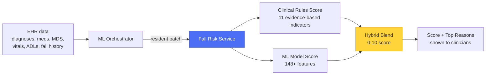

- **Clinical rules score:** 11 weighted indicators, e.g. balance change in the last 48h (weight 20), psychotropic medications (15), mobility device or mechanical lift (12), extensive assistance (11), recent admission (10), out-of-range vitals (9), pain (8), nutrition (7), continence (5), and behaviour (3). See [Clinical Factor Score Formula](#clinical-factor-score-formula).
- **ML score:**
  - A model trained on historical fall vs. non-fall events.
  - Inputs are demographics, diagnoses (ICD-10), medications, MDS assessments (Section GG mobility/self-care), point-of-care ADLs, vitals deviations, and fall history.
  - Recent falls also boost the score directly: a fall in the last 30 days lifts the ML probability to at least 0.90.
- **Hybrid blend:**
  - When the two scores agree, the higher one wins.
  - When they disagree, the blend is weighted toward the higher score and discounted by the lower one.
  - The result is scaled to 0–10. See [Hybrid Score Fusion Formula](#hybrid-score-fusion-formula).
- **Explainability:** Every score comes with its contributing factors. Rule-based factors are listed directly; ML factors come from SHAP feature attribution.

### Model Versions: V1 and V2

| Dimension | V1 — Production | V2 — Pre-production (shadow) |
|---|---|---|
| **Model** | Random Forest (100 trees, depth 30) | XGBoost (gradient-boosted trees) |
| **Model artifact size** | 565 MB | **125 KB** |
| **Python runtime** | 3.9 (end-of-life Oct 2025) on legacy ML stack (scikit-learn 1.2.2) | **3.12** with current stack (scikit-learn 1.9, numpy 2, pandas 2.3, shap 0.46) |
| **MDS functional codes** | Legacy Section G | **Section GG** (27 `gg01xx` features); G codes retired |
| **Features** | 138 | 148 base + 14 engineered = 162 |
| **Training data window** | Historical (pre-2023 extract) | Events after Oct 31, 2023 (~3 years) |
| **Explainability** | SHAP on a single representative tree | SHAP on the **full** boosted ensemble (more faithful) |
| **API contract** | Unchanged | **Unchanged.** Drop-in compatible for callers |
| **Deployment** | `ehr-fallrisk`, 10 replicas, prod | `ehr-fallrisk-v2`, 1 replica each in dev/QA/stg, private route, separate image and pipeline |
| **Artifacts location** | `s3://rcs-ehr-cai-s3-{env}/fallrisk/v1/` | `s3://rcs-ehr-cai-s3-{env}/fallrisk/v2/{pretrained,generated}/` |

**Delivery timeline**

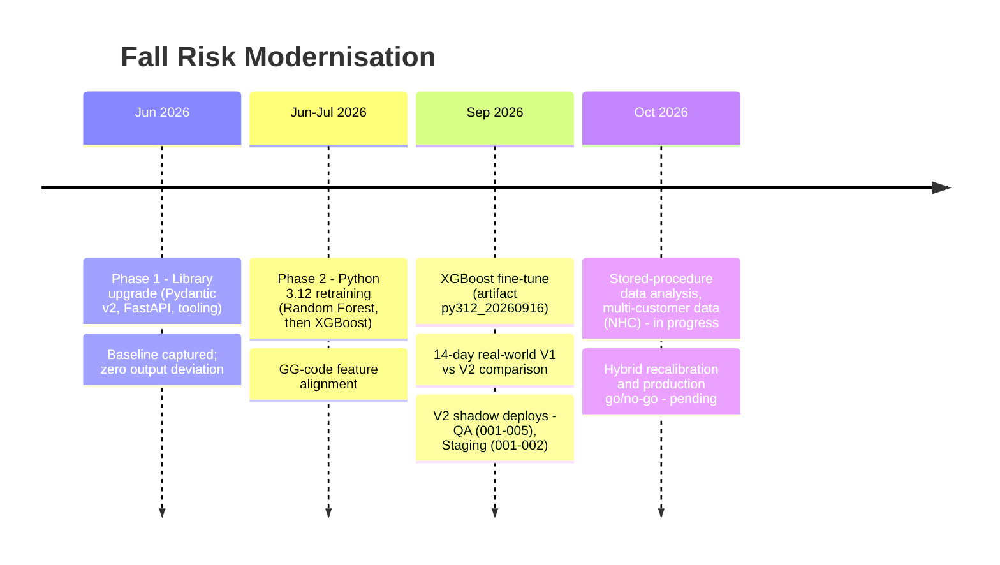

### Model Performance

**Reading the metrics**
- **Real-world prevalence:** In the evaluation sample, **6.8%** of residents fell within 14 days (136 of 2,000). A random selection would be right about 7% of the time.
- **Sensitivity (recall):** Share of residents who actually fell that were flagged. This is the patient-safety metric.
- **Precision:** Share of flagged residents who actually fell. This is the alert-fatigue / staff-workload metric.
- **Lift:** Precision ÷ prevalence, i.e. how many times better than random the model is at finding fallers.
- **Training holdout vs. real world:** Training data is deliberately near-balanced (56% falls), so holdout accuracy in the 80s **does not** imply 80%+ accuracy in production. Only the 14-day real-world comparison reflects clinical experience.

**Training holdout (balanced data)**

| Model | Accuracy | Precision | Recall | F1 | False positives | False negatives |
|---|---:|---:|---:|---:|---:|---:|
| V1 (Aug 2023 training) | 84.11% | 84.44% | 84.11% | 84.23% | 6.72% | 9.17% |
| V2 (Sep 15, 2026 fine-tune, Python 3.12) | 83.30% | 83.92% | 83.30% | 83.34% | **5.49%** | 11.22% |

Overall quality is comparable. V2 makes fewer false-positive errors and slightly more false-negative errors.

**Real-world 14-day outcome comparison (2,000 resident-days, 136 actual falls)**

ML score only (threshold ≥ 70):

| Metric | V1 | V2 | Change |
|---|---:|---:|---:|
| Residents flagged high-risk | 1,102 (55.1%) | **634 (31.7%)** | **−468 (−42%)** |
| Fallers caught (sensitivity) | 101 / 136 (74.3%) | 81 / 136 (59.6%) | −20 |
| Precision | 9.2% | **12.8%** | +3.6 pp |
| Lift over random | 1.35× | **1.88×** | +39% |
| False alarms (of all residents) | 50.1% | **27.7%** | −22.4 pp |

Hybrid score, as shown to clinicians (threshold ≥ 7):

| Metric | V1 | V2 | Change |
|---|---:|---:|---:|
| Residents flagged high-risk | 508 (25.4%) | 663 (33.2%) | +155 |
| Fallers caught (sensitivity) | 77 / 136 (56.6%) | **81 / 136 (59.6%)** | +4 |
| Precision | **15.2%** | 12.2% | −2.9 pp |
| Lift over random | **2.2×** | 1.8× | — |
| False alarms (of all residents) | **21.6%** | 29.1% | +7.6 pp |

**Interpretation**
1. **The V2 ML model is better at its own task.** It is more selective, has higher precision and lift, and roughly halves false alarms.
2. **The hybrid blend has not been tuned for V2.** Under V2 the hybrid catches the same 81 fallers as the ML score alone but adds about 30 extra false alarms. The blending rules and the ≥ 7 threshold were designed around V1's score distribution.
3. **Sample size is small.** With 136 falls, sensitivity estimates carry roughly **±8 percentage points** of uncertainty at 95% confidence. The 4-faller hybrid difference is not statistically meaningful, and the ML-only sensitivity drop is at the edge of significance.
4. **Next step:** Recalibrate the hybrid blend and threshold for V2 against an agreed operating point. Then re-evaluate on a larger, multi-customer sample before a production decision.

### Training Data

| Attribute | Value |
|---|---|
| Source | Snowflake stored procedure `SPML_FALLEVENTSWITHVITALS_WITH_GG` (`EHR_INSIGHTS_MATRIXCARE_US_SECURE_PRD`) |
| Customers | **One customer** (ID 18618) in the Sep 2026 training run. Additional customers (4061, 12116) are parameterised in the procedure; multi-customer support is in progress |
| Volume | ~145.8K events, ~90K unique residents (raw); 143,764 rows after filtering |
| Window | Events after Oct 31, 2023 (aligned to Section GG adoption) |
| Split | 80/20, **grouped by resident** so no resident appears in both train and test (prevents leakage) |
| Label mix | 55.8% fall / 44.2% non-fall (event-matched, not population prevalence) |
| Data quality | 59 of 179 raw columns are >70% missing (mostly optional MDS/vitals fields). Diagnosis is almost always present (0.23% missing) |

A model trained on one customer may not generalise to facilities with different documentation habits, resident mix, or acuity. Expanding to multiple customers is the main next step for model quality.

### Deployment and Rollout

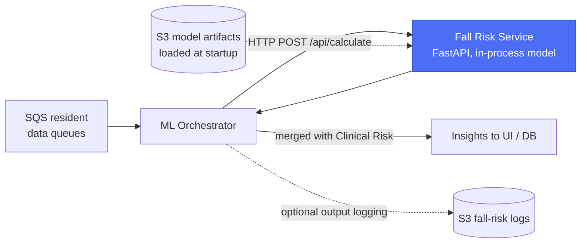

| Area | Detail |
|---|---|
| **Pattern** | Stateless REST microservice. Model runs **in-process**: no external model server, no runtime dependency on S3 or a database |
| **Callers** | `ml_orchestrator`, `ml_orchestrator_external`, `backend_service_manager` (debug), configured via `API_FALL_RISK_URL` |
| **Prod footprint (V1)** | 10 replicas × (2–3 CPU, 4–5 GiB), i.e. **20 CPU / 40 GiB reserved**, up to 30 CPU / 50 GiB |
| **Right-sizing** | V2's model is about 4,500× smaller. Pod memory and replica count can likely be reduced, but this must be **measured** in staging because Python, the preprocessing pipeline, and request dataframes still use memory |
| **Scaling** | Horizontal (replica count). No HPA configured |
| **CI/CD** | V1: `continuous-deployment-fallrisk-devx-eks.yml`. V2: `continuous-deployment-fallrisk-v2-devx-eks.yml`, a separate image and release triggered by tags `deploy-fallrisk-v2-{dev,qa,stg}-*` and gated to the `feature/fallrisk-v2` branch |
| **Rollout / rollback** | V2 runs **side by side** with V1. Cutover = point `API_FALL_RISK_URL` at V2. Rollback = point it back. V1 is not modified |
| **Regression safety** | Phase 1 upgrade validated with baseline capture, giving **zero output deviation** (CSV diff plus deep JSON equality) |

### Security and Compliance Considerations

| Area | Current state | Note |
|---|---|---|
| **Data handled** | Resident PHI (demographics, diagnoses, meds, assessments, vitals) | Processed in memory; the service does not persist it |
| **Authentication** | **No application-level auth.** Access is controlled by private networking, ingress, and IAM | Defence-in-depth gap. Other services (e.g. DSAIL Depression) enforce JWT |
| **AWS access** | Cross-account IAM role scoped to model-artifact S3 reads | Least privilege |
| **Container** | Non-root user, all capabilities dropped, `no-new-privileges` | Hardened |
| **Output logging** | ML Orchestrator can log fall-risk requests and outputs to S3 (`API_ENABLE_FALL_RISK_LOGGING`) | Confirm retention, encryption, and access policy for PHI in those logs |
| **Training data** | Pulled from the secure Snowflake analytics DB under role-based access | Confirm per-customer data-use rights for model training (the legacy pipeline filtered on `AccessRights = 1`) |
| **Regulatory classification** | **[TBD — confirm with Regulatory/QA]** | Clinical decision support vs. SaMD status, intended-use statement, and change-control obligations for a model change (V1 → V2) |

### Known Risks and Gaps

| # | Risk / Gap | Impact | Mitigation / Next step |
|---|---|---|---|
| 1 | Training data from a **single customer** | Model may underperform at other facilities | Add multi-customer data (NHC, others); evaluate per customer |
| 2 | **Hybrid blend not recalibrated** for V2 | Clinician-facing score has more false alarms than V1 | Retune blend and threshold to an agreed operating point |
| 3 | **Small real-world evaluation** (136 falls) | Wide confidence intervals; risk of a wrong go/no-go call | Larger, multi-customer, multi-period backtest |
| 4 | V1 on **end-of-life Python 3.9** and old ML stack | Security patch exposure, maintenance friction | Ship V2 (Python 3.12) |
| 5 | V1 uses **retired MDS Section G** codes | Features drift from what facilities record today | V2 uses Section GG |
| 6 | **No application-level authentication** | Relies solely on network controls | Add service-to-service auth (OAuth2/JWT pattern already in `services/shared/security`) |
| 7 | **Health probes disabled** in Helm | Kubernetes cannot auto-detect or recycle unhealthy pods | Enable readiness/liveness probes and align the probe path with the service route |
| 8 | **Manual, notebook-based training** with filename-based versioning | Reproducibility, audit trail, retraining speed | Move to a scripted pipeline with a model registry and model cards |
| 9 | **No automated drift or performance monitoring** | Silent degradation over time | Scheduled backtest against actual fall events (drift notebooks exist but are manual) |
| 10 | **Fairness / subgroup analysis** not documented | Equity and regulatory exposure | Evaluate by age band, gender, facility type, and customer |
| 11 | Recent-fall **probability boost** is a hard-coded rule outside the model | Masks model behaviour; harder to validate | Review with clinical SMEs; consider learning it in-model |

### Open Decisions

1. **Operating point:** Prioritise catching more fallers (more alerts) or fewer false alarms (lower staff workload). This sets the hybrid threshold.
2. **Training data scope:** Use multi-customer de-identified data for training and evaluation, within contractual data-use rights.
3. **Production criteria (proposed):**
   - On a multi-customer backtest, V2 hybrid matches or beats V1 sensitivity **and** does not exceed V1's flagged-resident rate.
   - Clinical sign-off and regulatory review are complete.
4. **Clinical validation:** Clinical SMEs review rule weights, explanations, and the recent-fall boost.
5. **MLOps foundations:** Training pipeline, model registry, drift monitoring, and service auth.
6. **Infrastructure right-sizing:** A measured reduction of the 10 × 5 GiB footprint after V2 cutover.

### FAQ

| Question | Answer |
|---|---|
| *What does the service deliver?* | Residents at elevated fall risk, with reasons, so staff can intervene early. |
| *How accurate is it?* | Among flagged residents it is about **2× better than chance** at identifying who will fall within 14 days (hybrid V1 lift 2.2×; V2 ML lift 1.9×). It catches roughly 55–75% of fallers depending on the threshold. About 7% of residents fall in a 14-day window, which makes prediction inherently hard. |
| *Is V2 better?* | The ML model is: about 42% fewer flags at higher precision. The hybrid score still needs recalibration before it clearly improves on V1. |
| *Why XGBoost over Random Forest?* | Comparable holdout quality, a much smaller artifact (125 KB vs 565 MB), faster load, and SHAP explains the full ensemble rather than one tree. The Python 3.12 Random Forest retrain was weaker (81% accuracy). |
| *How is data leakage prevented?* | Resident-grouped train/test split, a strict date window, and future-fall labels computed from a separate fall-events extract. |
| *How was the library upgrade validated?* | Phase 1 used baseline capture and post-upgrade replay with CSV diff plus deep JSON equality, giving zero deviation. Phase 2 (new model) is validated via holdout plus a real-world 14-day backtest. |
| *What is the rollout risk?* | Low. V2 runs side by side with V1 and the API contract is unchanged. Switching or rolling back is a configuration change (`API_FALL_RISK_URL`). |
| *Can customers opt out?* | Yes. Fall Risk is toggled per customer. |
| *What if it misses a fall?* | It is a decision-support tool; clinicians remain responsible for care decisions. Intended-use wording and regulatory classification are to be confirmed with Regulatory/QA. |
| *How is the model versioned?* | Notebooks, pinned dependencies, seeded randomness, and versioned artifact names (e.g. `py312_20260916`). A scripted pipeline with a registry is a planned improvement. |

### Metrics to Track

| Metric | Source | Value |
|---|---|---|
| Active Fall Risk customers / facilities | CAI activation table (`fallrisk_active_flag`) | [TBD] |
| Residents scored per day | Datadog / orchestrator logs | [TBD] |
| p50 / p95 latency per batch | Datadog APM | [TBD] |
| Monthly infra cost (fallrisk pods) | AWS / Kubecost | [TBD] |
| V2 staging memory per pod | Datadog container metrics | [TBD] |
| Error rate (5xx), last 30 days | Datadog | [TBD] |
| Target production date for V2 | Product / Engineering | [TBD] |

### Glossary

| Term | Meaning |
|---|---|
| **MDS** | Minimum Data Set, the CMS-mandated resident assessment in skilled nursing facilities |
| **Section G / GG** | MDS functional status sections. GG (mobility and self-care) replaced the G ADL items in Oct 2023 |
| **ADL / POC** | Activities of Daily Living / Point-of-Care documentation by staff |
| **SHAP** | Method that attributes a model's prediction to its input features (explainability) |
| **Hybrid score** | Blend of the rules-based clinical score and the ML score, scaled 0–10 |
| **Sensitivity / Recall** | Share of actual fallers the model flags |
| **Precision** | Share of flagged residents who actually fall |
| **Lift** | Precision ÷ prevalence, i.e. improvement over random selection |
| **Shadow deployment** | New version runs in parallel without affecting production traffic |

### Related Documentation

- Detailed scoring logic (rules, features, weights): [FALLRISK_Prediction_Service.md](../models/fallrisk/docs/FALLRISK_Prediction_Service.md)
- V1 vs V2 comparison: [FALLRISK_Comparison.md](../models/fallrisk/docs/FALLRISK_Comparison.md)
- Python upgrade and Phase 1 validation: [python_upgradation_summary.md](../models/fallrisk/docs/python_upgradation_summary.md)
- Training data procedure: [snowflake_fallrisk_proc_doc.md](../models/fallrisk/docs/snowflake_fallrisk_proc_doc.md)
- Latest training notebook: [fall-risk-training-py3.12_2026-09.ipynb](../models/fallrisk/fall-risk-training-py3.12_2026-09.ipynb)
- V2 deployment values: [helm-values/fallrisk-v2/](../helm-values/fallrisk-v2/)
- V1 production values: [values-prod-amr-saas.yaml](../helm-values/fallrisk/values-prod-amr-saas.yaml)

---

## Service Overview

The Fall Risk service computes resident-level fall risk using a hybrid approach:
- clinical-factor scoring from resident EHR data,
- ML model scoring from engineered features,
- score fusion into a final Hybrid Score.

This document is intentionally scoped to the fallrisk service only.

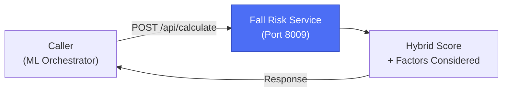

---

## High-Level Processing Flow

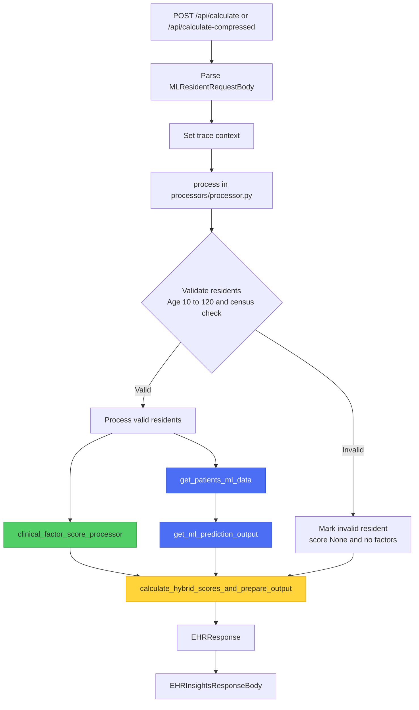

Key points:
- This flow is clearer because it shows the explicit validation decision and the invalid-resident branch returning into final assembly.
- Pipeline stages are visually separated: clinical branch, ML branch, and hybrid merge point.
- It captures the real execution shape end-to-end, including trace context setup and final response wrapping.

---

## API Endpoints

Source: [services/ml_services/fallrisk/api/web/api/fallrisk/views.py](services/ml_services/fallrisk/api/web/api/fallrisk/views.py)

Health/docs routes:
- [services/ml_services/fallrisk/api/web/api/monitoring/views.py](services/ml_services/fallrisk/api/web/api/monitoring/views.py)
- [services/ml_services/fallrisk/api/web/api/docs/views.py](services/ml_services/fallrisk/api/web/api/docs/views.py)

### Inference Routes

| Method | Path | Description | Authentication |
|---|---|---|---|
| POST | /api/calculate | Main fall-risk inference endpoint (Hybrid Score + factors considered) | None enforced in-service† |
| POST | /api/calculate-compressed | Same as `/api/calculate`, but accepts a zlib-compressed JSON body | None enforced in-service† |
| POST | /api/get_patients_ml_data | Debug/helper endpoint that returns engineered ML features without running the model | None enforced in-service† |

### Health and Documentation

| Method | Path | Description | Authentication |
|---|---|---|---|
| GET | /api/health | Health/liveness endpoint used by Docker and Kubernetes probes | None |
| GET | /api/docs | Swagger UI | None |
| GET | /api/redoc | ReDoc UI | None |

† No JWT or API-key check exists in the FastAPI route handlers. See **Authentication and Security** below for how access is actually controlled.

---

## Deployment Configuration (Kubernetes / Helm)

**Helm values:** [helm-values/fallrisk/values-prod-amr-saas.yaml](helm-values/fallrisk/values-prod-amr-saas.yaml)
**Container build:** [services/ml_services/fallrisk/deploy/Dockerfile](services/ml_services/fallrisk/deploy/Dockerfile)
**Local/dev compose:** [services/ml_services/fallrisk/deploy/docker-compose.yml](services/ml_services/fallrisk/deploy/docker-compose.yml)

### Service Configuration

| Setting | Value | Purpose |
|---|---|---|
| **Service Name** | `ehr-fallrisk` (local container) / `fallrisk` (Helm release) | Deployed service identifier |
| **Container Port** | `8009` (local Docker Compose) · `8080` (production Helm `service.port`/`targetPort`) | FastAPI port, configurable via `API_PORT` |
| **Python Version** | 3.12 (`python:3.12.13-slim-bookworm`) | Runtime environment |
| **Process Manager** | Gunicorn + `UvicornWorker` when `API_WORKERS_COUNT > 1`; plain Uvicorn otherwise | `api/__main__.py` |
| **Start Command** | `python -m api` (wrapped with `ddtrace-run` when `DD_TRACE_ENABLED=true`) | Container `CMD` |
| **Workers per Replica** | `API_WORKERS_COUNT` (prod: `2`) | Gunicorn preload workers, share models via copy-on-write fork |
| **Replicas** | `10` (prod Helm `replicaCount`) | Horizontal scaling / high availability |
| **Deployment Target** | `ec2` | Helm `deployment.target` |

### Model Artifact Management (S3)

Seven pickle/joblib artifacts are downloaded from S3 at startup and cached under `api/data/` (bucket structure `rcs-ehr-cai-s3-{env}/fallrisk/v1/{file}`):

| Artifact | S3 Key | Local Path |
|---|---|---|
| Diagnosis dictionary | `fallrisk/v1/diagnosis-dictionary.pkl` | `api/data/diagnosis-dictionary.pkl` |
| Drug list dictionary | `fallrisk/v1/druglist-dictionary.pkl` | `api/data/druglist-dictionary.pkl` |
| New drug list dictionary | `fallrisk/v1/new-druglist-dictionary.pkl` | `api/data/new-druglist-dictionary.pkl` |
| SHAP explainer | `fallrisk/v1/explainer1.0.pkl` | `api/data/explainer1.0.pkl` |
| Fall-risk model (`rf_model`) | `fallrisk/v1/fall-risk-analysis1.0.joblib` | `api/data/fall-risk-analysis1.0.joblib` |
| Column order list | `fallrisk/v1/order-dictionary.pkl` | `api/data/order-dictionary.pkl` |
| Preprocessing pipeline | `fallrisk/v1/pipeline-preprocess1.0.pkl` | `api/data/pipeline-preprocess1.0.pkl` |

`API_S3_BUCKET` selects the bucket (prod: `rcs-ehr-cai-s3-prod`). `API_FALLRISK_OVERWRITE=false` (default) skips re-downloading files that already exist locally; set to `true` to force a refresh from S3.

### Production Resource Configuration

| Resource | Value | Purpose |
|---|---|---|
| **CPU Request** | 2 cores | Guaranteed CPU allocation |
| **CPU Limit** | 3 cores | Maximum CPU allowance |
| **Memory Request** | 4096 Mi | Guaranteed memory (4 GB minimum for stable operation) |
| **Memory Limit** | 5120 Mi | Maximum memory (5 GB required for ML model loading) |
| **Replicas** | 10 | Production redundancy |
| **Ephemeral Volumes** | `/tmp`, `/app/src/api/data` (emptyDir) | Scratch space and model artifact cache |
| **Ingress Timeouts** | 360s read/send | `nginx.ingress.kubernetes.io/proxy-*-timeout` |

### Authentication and Security

| Configuration | Value |
|---|---|
| **Application-level Authentication** | Not implemented — route handlers in `views.py` do not validate a bearer token or API key |
| **Access Control** | Enforced at the infrastructure layer (ingress, private networking, cross-account IAM role) |
| **AWS Access** | Cross-account IAM role `rcs-ehr-fallrisk-cross-account` (`AWS_ROLE_ARN`), scoped to S3 model-artifact reads |
| **APM/Tracing** | Datadog (`DD_TRACE_ENABLED=true`, `DD_TRACE_SAMPLE_RATE=0.001`) via `ddtrace-run`, auto-patched through the shared `services.shared` package |
| **Container User** | Non-root `appuser` (UID/GID 1000); `no-new-privileges`, all capabilities dropped except `NET_BIND_SERVICE` |

### Environment Variables

| Variable | Source | Purpose |
|---|---|---|
| `API_HOST` / `API_PORT` | Helm env | Bind address/port (prod: `0.0.0.0:8080`) |
| `API_WORKERS_COUNT` | Helm env | Gunicorn worker count per replica (prod: `2`) |
| `API_ENVIRONMENT` | Helm env | Environment name (`prod`/`stg`/`qa`/`dev`) |
| `API_LOG_LEVEL` | Helm env | Python logging level |
| `API_S3_BUCKET` | Helm env | Bucket holding model artifacts |
| `API_FALLRISK_OVERWRITE` | Helm env / settings default | Force re-download of model artifacts |
| `AWS_PROFILE` / `AWS_ROLE_ARN` / `AWS_REGION` | Helm env | Cross-account IAM role used for S3 access |
| `DATA_DIR` | Helm env | Model artifact cache directory (`/app/src/api/data`) |
| `DD_TRACE_ENABLED` / `DD_TRACE_SAMPLE_RATE` | Helm env | Datadog APM tracing |

---

## Input and Output Contracts

### Input Schema

**Primary request model:** `MLResidentRequestBody`
**Model location:** [services/ml_services/fallrisk/api/ehr_common/input_contract/resident_ml_schema.py](services/ml_services/fallrisk/api/ehr_common/input_contract/resident_ml_schema.py)

```json
{
 "source": "MATRIXCARE",
 "data_source_id": "DS001",
 "corporate_id": "CORP001",
 "customer_id": "FAC001",
 "trace_id": "trace-abc-123",
 "calculation_date": "2026-07-01T00:00:00Z",
 "risk_assessment_list": ["FallRisk"],
 "resident_medical_data": [
   {
     "resident_id": "RES-001",
     "demographic": {
       "age": "82",
       "gender": "F",
       "date_of_admission": "2025-01-15T00:00:00Z",
       "smoking_status": "Never"
     },
     "diagnosis": [
       {
         "effective_datetime": "2025-06-01T00:00:00Z",
         "coding_type": "ICD10",
         "diagnosis_code": "R29.6",
         "description": "Repeated falls"
       }
     ],
     "medication_order_administration": [],
     "point_of_care": [],
     "minimum_data_set": [],
     "vitals": [],
     "event_history": []
   }
 ]
}
```

**Required top-level fields:**
- `source`, `data_source_id`, `corporate_id`, `customer_id` — source identifier metadata
- `resident_medical_data[]` — one entry per resident to score

**Required fields per resident (`ResidentMedicalDataForML`):**
- `resident_id` — resident identifier
- `demographic` — `age`, `gender`, `date_of_admission` (used for age/census validation)
- Clinical history arrays are optional: `diagnosis`, `medication_order_administration`, `point_of_care`, `minimum_data_set`, `vitals`, `event_history`, `observation_history`, `wound_history`, `progress_notes`, `active_care_plans`

**Validation rules applied before scoring (`remove_invalid_patient`):**
- Resident `age` must be between 10 and 120 (inclusive range check)
- `date_of_admission` must be on/before `calculation_date` (valid census)
- Residents failing either check are excluded from scoring and returned with a `null` score

### Output Schema

**Wrapper:** `EHRInsightsResponseBody`
**Core response model:** `EHRResponse`
**Model location:** [services/ml_services/fallrisk/api/ehr_common/output_contract/resident_risk_output.py](services/ml_services/fallrisk/api/ehr_common/output_contract/resident_risk_output.py)

```json
{
 "status": 200,
 "status_message": "Executed Successfully",
 "response": {
   "source": "MATRIXCARE",
   "data_source_id": "DS001",
   "corporate_id": "CORP001",
   "customer_id": "FAC001",
   "resident_risk_result": [
     {
       "resident_id": "RES-001",
       "resident_overall_risk_score": 6,
       "factors_considered": [
         {
           "risk_type": "Fall Risk",
           "risk_score": 6,
           "risk_factors": [
             {
               "feature_group": "Clinical Factors",
               "feature_type": "Diagnosis",
               "feature_name": "Repeated falls",
               "feature_description": "R29.6",
               "feature_value": "2025-06-01T00:00:00Z"
             },
             {
               "feature_group": "ML Model",
               "feature_type": "Medication",
               "feature_name": "Psychotropic medication",
               "feature_description": null,
               "feature_value": null
             }
           ]
         }
       ]
     }
   ]
 }
}
```

**Response fields:**
- `resident_overall_risk_score` — final Hybrid Score (0-10), or `null` for residents excluded by validation
- `factors_considered[].risk_factors[]` — merged clinical + ML factors, sourced from SHAP-ranked ML features and rule-based clinical indicators
- Invalid residents are returned with `resident_overall_risk_score: null` and an empty `factors_considered` list rather than being dropped from the response

**Error responses:**
- `statusCode: 400` — malformed zlib payload on `/api/calculate-compressed` (`Invalid compressed payload`)
- `statusCode: 422` — Pydantic schema validation failure (missing/invalid fields)
- `statusCode: 500` — unhandled pipeline exception (model inference, feature engineering); logged via loguru and re-raised to FastAPI's default handler

---

## End-to-End Execution Path

### High-Level Architecture

- The endpoint accepts a plain or zlib-compressed `MLResidentRequestBody` and validates it against the Pydantic schema.
- Resident-level validation (age 10-120, valid census) happens once, before either scoring branch runs.
- Clinical-factor scoring and ML feature engineering/inference run as independent branches over the same validated resident batch.
- SHAP-based explainability (`explainer1.0.pkl`) is computed only when `ml_considered_factors=true`, keeping the score-only path fast.
- The two branches are merged by `calculate_hybrid_score()` into a single Hybrid Score per resident, plus a combined `risk_factors` list.

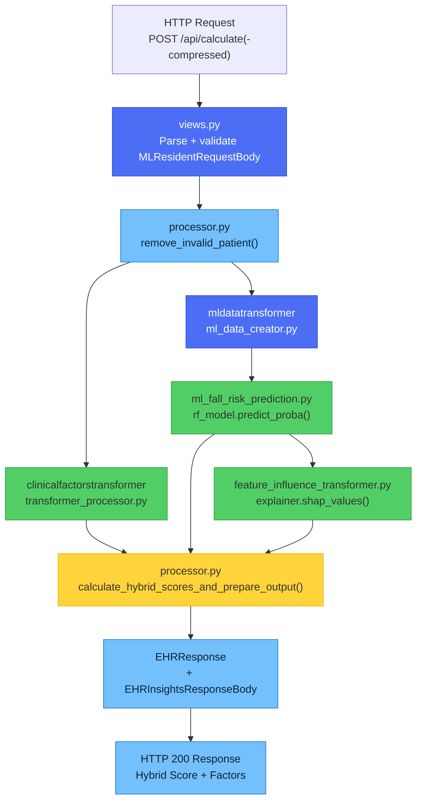

### Detailed Execution Sequence

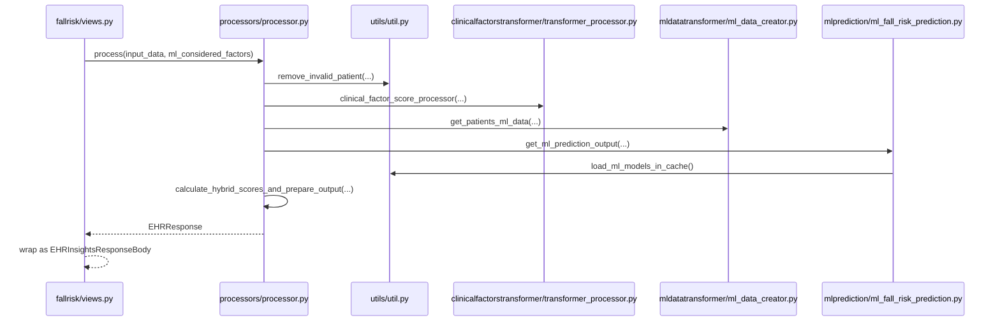

Main entry functions:
- API layer: calculate, calculate_fallrisk, get_patients_data
- Orchestration layer: process
- Clinical scoring: clinical_factor_score_processor
- ML feature engineering: get_patients_ml_data
- ML prediction: get_ml_prediction_output
- Fusion logic: calculate_hybrid_score, calculate_hybrid_scores_and_prepare_output

---

## Detailed Processing Stages

### Stage map at a glance

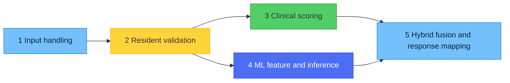

### 1) Input handling and endpoint dispatch

Files:
- [services/ml_services/fallrisk/api/web/api/fallrisk/views.py](services/ml_services/fallrisk/api/web/api/fallrisk/views.py)

Input:
- JSON payload or zlib-compressed payload.

Output:
- Validated request object sent to process orchestration.

What happens:
- /calculate accepts JSON and validates MLResidentRequestBody.
- /calculate-compressed decompresses zlib payload, parses JSON, validates schema, then calls process.
- Query flag ml_considered_factors controls whether ML considered-factor extraction is included.

### 2) Resident validation and filtering

Files:
- [services/ml_services/fallrisk/api/services/processors/processor.py](services/ml_services/fallrisk/api/services/processors/processor.py)
- [services/ml_services/fallrisk/api/utils/util.py](services/ml_services/fallrisk/api/utils/util.py)

Input:
- Validated resident batch and calculation date.

Output:
- Valid residents for scoring and placeholder outputs for invalid residents.

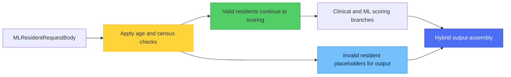

### 3) Clinical factor scoring pipeline

Files:
- [services/ml_services/fallrisk/api/services/transformers/clinicalfactorstransformer/transformer_processor.py](services/ml_services/fallrisk/api/services/transformers/clinicalfactorstransformer/transformer_processor.py)

Input:
- Valid resident clinical records and calculation date.

Output:
- Clinical risk score plus clinical factors_considered entries.

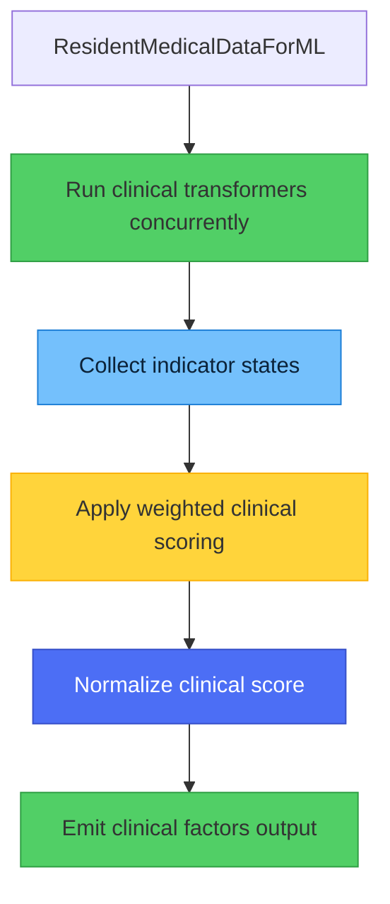

### 4) ML feature engineering and prediction pipeline

Files:
- [services/ml_services/fallrisk/api/services/transformers/mldatatransformer/ml_data_creator.py](services/ml_services/fallrisk/api/services/transformers/mldatatransformer/ml_data_creator.py)
- [services/ml_services/fallrisk/api/services/mlprediction/ml_fall_risk_prediction.py](services/ml_services/fallrisk/api/services/mlprediction/ml_fall_risk_prediction.py)

Input:
- Valid resident clinical records.

Output:
- ML risk score with optional ML considered factors.

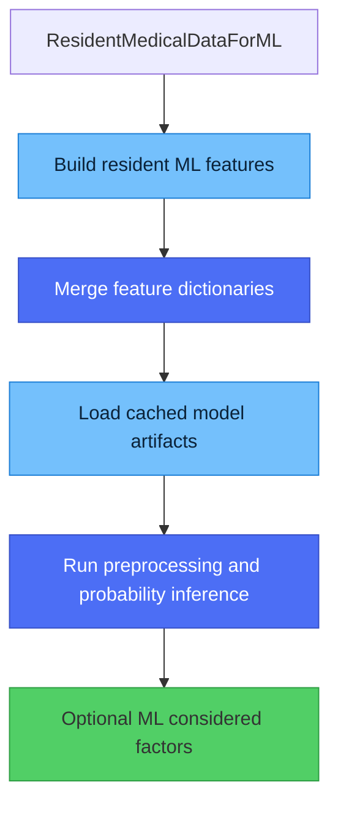

### 5) Hybrid score fusion and response assembly

Files:
- [services/ml_services/fallrisk/api/services/processors/processor.py](services/ml_services/fallrisk/api/services/processors/processor.py)

Input:
- Clinical score/factors and ML score/factors per resident.

Output:
- Final EHRResponse with resident_overall_risk_score and merged factors.

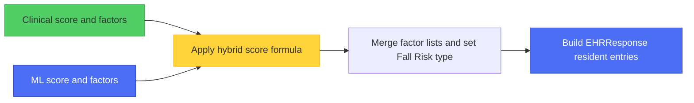

---

## Model and Inference Architecture

Files:
- [services/ml_services/fallrisk/api/utils/util.py](services/ml_services/fallrisk/api/utils/util.py)
- [services/ml_services/fallrisk/api/services/mlprediction/ml_fall_risk_prediction.py](services/ml_services/fallrisk/api/services/mlprediction/ml_fall_risk_prediction.py)
- [services/ml_services/fallrisk/api/services/mlprediction/feature_influence_transformer.py](services/ml_services/fallrisk/api/services/mlprediction/feature_influence_transformer.py)

### Pre-trained Model Artifacts

| Aspect | Details |
|---|---|
| **Model Type** | Random Forest-style ensemble classifier (`rf_model`), invoked via `predict_proba()` |
| **Model Artifact** | `fall-risk-analysis1.0.joblib`, loaded with `joblib.load()` |
| **Explainability** | SHAP explainer (`explainer1.0.pkl`), computed via `explainer.shap_values(df_trans, check_additivity=False)` |
| **Preprocessing** | `pipeline-preprocess1.0.pkl` transforms engineered features before inference |
| **Feature Ordering** | `order-dictionary.pkl` enforces the exact column order the model was trained on |
| **Training Process** | External ML pipeline (not in this repository); artifacts versioned by filename suffix (e.g. `1.0`) |

### Model Loading and Caching

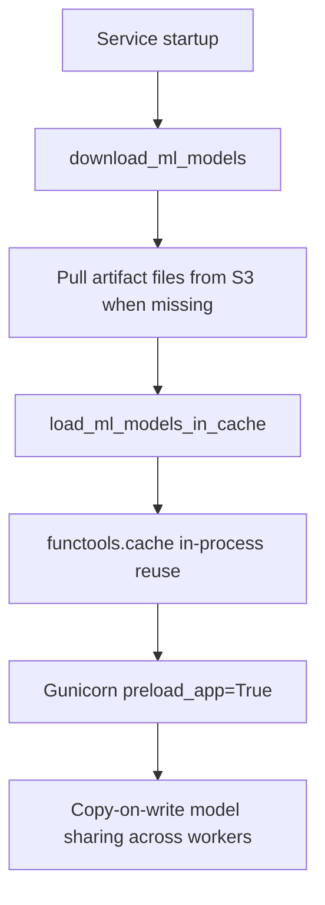

What happens:
- `download_ml_models()` ensures the seven pickle/joblib artifacts exist locally before the app starts (see **Model Artifact Management (S3)** above).
- `load_ml_models_in_cache()` is decorated with `functools.cache`, so each process loads the artifacts once.
- When `API_WORKERS_COUNT > 1`, Gunicorn's `preload_app=True` loads models in the master process **before** forking workers, so all workers share the same in-memory models via copy-on-write — avoiding N-times memory duplication.

### Clinical Factor Score Formula

Source: `clinical_factor_score_processor()`, `score()`, and `calculate_original_clinical_score()` in [transformer_processor.py](../services/ml_services/fallrisk/api/services/transformers/clinicalfactorstransformer/transformer_processor.py). Weights are defined in [clinical_factor_constants.py](../services/ml_services/fallrisk/api/utils/clinical_factor_constants.py).

**Step 1 — Raw clinical score.** Six clinical transformers run concurrently (`asyncio.gather`): admission, diagnosis, MDS, POC, vitals, and medication. Together they produce 11 indicators. Each indicator contributes its weight when its value is greater than 0:

$$
\text{raw\_score} = \sum_{i \in \text{binary}} w_i \cdot \mathbb{1}[\,\text{indicator}_i > 0\,]
\;+\; 15 \cdot v_{\text{psych}}
$$

The sum covers the 10 binary indicators below. The psychotropic-medication term is the only weighted (non-binary) contribution.

| # | Indicator | Weight $w_i$ | Contribution |
|---|---|---:|---|
| 1 | Balance change in last 48h | 20 | Binary |
| 2 | Psychotropic medications | 15 | `15 × v_psych` (see below) |
| 3 | Mobility device **or** mechanical lift | 12 | Binary. The two indicators are combined into one for scoring and kept separate for display |
| 4 | Extensive assistance in last 48h | 11 | Binary |
| 5 | Admission in last 48h | 10 | Binary |
| 6 | Vitals out of range | 9 | Binary |
| 7 | Evidence of pain | 8 | Binary |
| 8 | Nutrition | 7 | Binary |
| 9 | Continence | 5 | Binary |
| 10 | Behaviour symptoms | 3 | Binary |
| 11 | Fall with injury | 0 | Listed in `risk_factors` only. Does not affect the score |

**Psychotropic recency value $v_{\text{psych}}$.** This is the maximum value across the resident's qualifying psychotropic medications:

| Last administration relative to `calculation_date` | $v_{\text{psych}}$ |
|---|---:|
| Within last 7 days | 1.0 |
| 7–30 days ago | 0.6 |
| More than 30 days ago (order still active) | 0.4 |
| No administration date | 0.2 |

The weights sum to 100, so $0 \le \text{raw\_score} \le 100$.

**Step 2 — Original (transformed) clinical score.** A concave transform boosts low and mid raw scores while preserving the 0–100 range:

$$
\text{clinical\_score} = 2 \cdot \text{raw\_score} - \frac{\text{raw\_score}^2}{100}
$$

| Raw score | Clinical score |
|---:|---:|
| 0 | 0 |
| 20 | 36 |
| 43 | 67.51 |
| 50 | 75 |
| 70 | 91 |
| 100 | 100 |

**Worked example.** A resident with a balance change (20), a psychotropic administered within 7 days (15 × 1.0), and pain (8) has:
- raw score = 43;
- clinical score = 2 × 43 − 43²/100 = **67.51**.

The resulting `clinical_score` is emitted as `risk_score` on the `"Clinical Fall Risk"` factor group. It is then passed as `clinical_score` into the hybrid fusion below.

### Hybrid Score Fusion Formula

`calculate_hybrid_score(ml_score, clinical_score)` in `processor.py` blends the two 0-100 branch scores into a single 0-10 Hybrid Score:

| Condition | Formula |
|---|---|
| Both scores ≥ 70 | Weighted toward the higher score, discounted by the other: `(higher + lower * (100 - higher) / 150) / 10` |
| \|ml_score - clinical_score\| ≤ 20 | Take the higher of the two scores directly: `max(ml_score, clinical_score) / 10` |
| \|ml_score - clinical_score\| ≤ 50 | Simple average: `(ml_score + clinical_score) / 20` |
| Otherwise | The higher score is discounted toward the lower: `(higher - higher * (50 - lower) / 200) / 10` |

If neither branch produces any risk factors for a valid resident, a default "Age of resident" clinical factor is appended so the output is never empty.

### Feature Engineering Sources

| Signal Type | Examples | Processing |
|---|---|---|
| Diagnoses | ICD-10 codes (e.g. `R29.6`) | Mapped via `diagnosis-dictionary.pkl` |
| Medications | Drug class/name | Mapped via `druglist-dictionary.pkl` / `new-druglist-dictionary.pkl` |
| MDS/Assessments | Question code + answer value | One-hot/indicator encoding |
| Point of Care (ADL) | POC type/category/response | Balance, continence, nutrition indicators |
| Vitals | Blood pressure, temperature, blood sugar | Unit conversion (°C→°F, mmol/L→mg/dL) + deviation-from-baseline calculation |
| Demographics | Age, gender, admission date | Direct numeric/categorical features |
| Event history | Falls, incidents | Recency-weighted event features |

### SHAP-based Explainability

- `FeatureInfluenceTransformer` (in `feature_influence_transformer.py`) runs `explainer.shap_values()` against the preprocessed feature frame to rank each resident's top ML-driving features.
- Explainability only runs when `ml_considered_factors=true` (default) is passed to `/api/calculate`; skipping it returns a score-only ML result (`prepare_result_without_ml_factors`) for lower latency.
- SHAP output is mapped back to human-readable factor names per domain (diagnosis, medication, vitals, MDS, POC/ADL, event history) in `ml_considered_factors.py`.

---

## Script-Level Visual Explainer

This section explains what each important fallrisk script is responsible for in the runtime path.

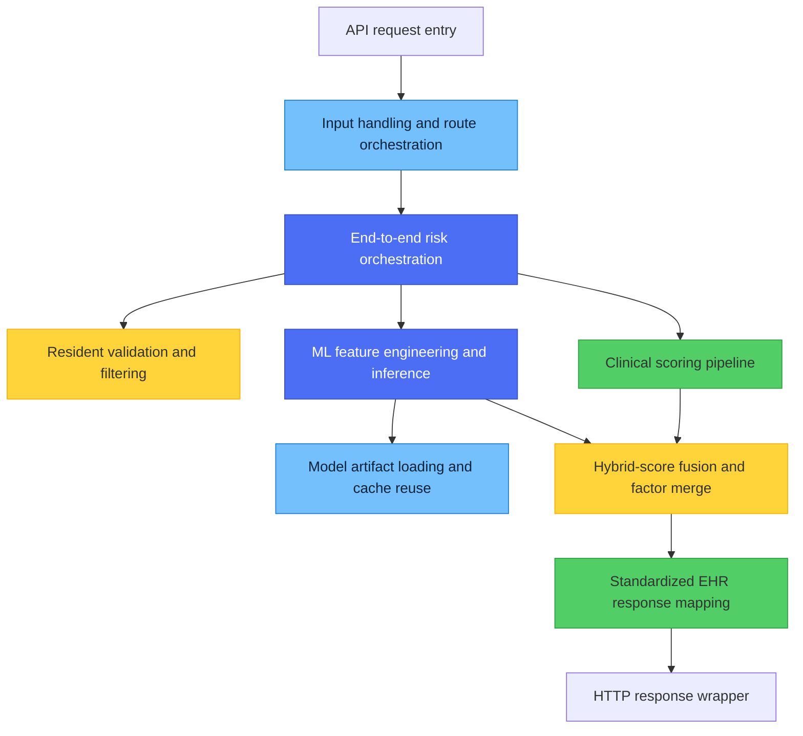

### End-to-end orchestration and hybrid fusion ([services/ml_services/fallrisk/api/services/processors/processor.py](services/ml_services/fallrisk/api/services/processors/processor.py))

Purpose:
- Central coordinator that combines validation, clinical scoring, ML scoring, and response assembly.
- Owns hybrid-score fusion logic and final resident-level result composition.

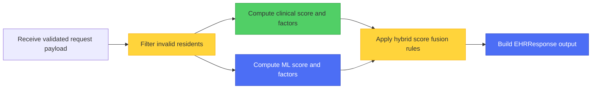

### Clinical scoring pipeline ([services/ml_services/fallrisk/api/services/transformers/clinicalfactorstransformer/transformer_processor.py](services/ml_services/fallrisk/api/services/transformers/clinicalfactorstransformer/transformer_processor.py))

Purpose:
- Aggregates clinical indicator transformers and computes weighted clinical fall-risk score.
- Produces clinically traceable factor lists for downstream explanation.

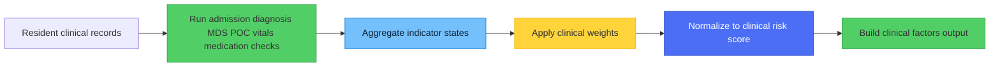

### ML feature engineering pipeline ([services/ml_services/fallrisk/api/services/transformers/mldatatransformer/ml_data_creator.py](services/ml_services/fallrisk/api/services/transformers/mldatatransformer/ml_data_creator.py))

Purpose:
- Converts resident clinical history into ML-ready feature dictionaries.
- Merges event, medication, diagnosis, demographics, vitals, MDS, and POC/ADL features into a unified representation.

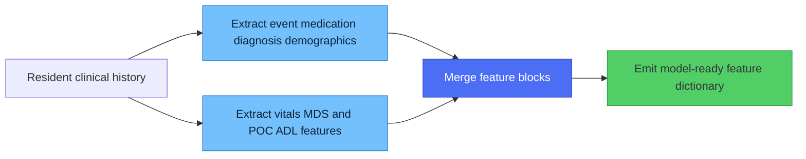

### ML inference and explainability pipeline ([services/ml_services/fallrisk/api/services/mlprediction/ml_fall_risk_prediction.py](services/ml_services/fallrisk/api/services/mlprediction/ml_fall_risk_prediction.py))

Purpose:
- Executes ML inference and optional explainability path for considered factors.
- Converts engineered features into risk probabilities and explanation-ready ML factor outputs.

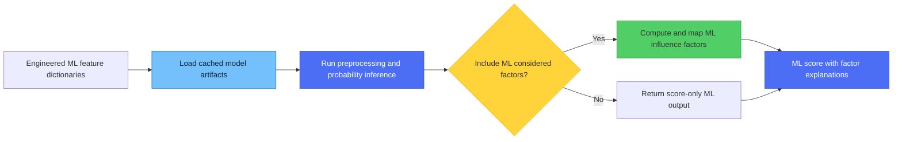

### Resident validation and filtering ([services/ml_services/fallrisk/api/utils/util.py](services/ml_services/fallrisk/api/utils/util.py))

Purpose:
- Enforces resident eligibility checks before scoring (age and census validation).
- Provides shared utility logic used across clinical and ML pipelines.

### API request handling ([services/ml_services/fallrisk/api/web/api/fallrisk/views.py](services/ml_services/fallrisk/api/web/api/fallrisk/views.py))

Purpose:
- Handles plain and compressed request entrypoints.
- Performs payload decoding and schema validation, then delegates to orchestration.

### Model artifact lifecycle and warmup ([services/ml_services/fallrisk/api/__main__.py](services/ml_services/fallrisk/api/__main__.py), [services/ml_services/fallrisk/api/web/lifetime.py](services/ml_services/fallrisk/api/web/lifetime.py))

Purpose:
- Controls startup mode and preload behavior for model artifacts.
- Ensures model cache is ready before handling runtime requests.

### Runtime configuration ([services/ml_services/fallrisk/api/settings.py](services/ml_services/fallrisk/api/settings.py))

Purpose:
- Defines environment-driven runtime, artifact paths, S3 keys, and overwrite controls.

---

## Observability, Tracing, and Diagnostics

Files:
- [services/ml_services/fallrisk/api/logging.py](services/ml_services/fallrisk/api/logging.py)
- [services/ml_services/fallrisk/deploy/Dockerfile](services/ml_services/fallrisk/deploy/Dockerfile)

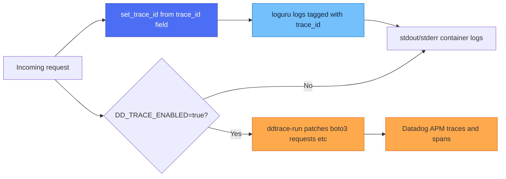

What happens:
- Every request's `trace_id` (if supplied in the payload) is propagated into a `ContextVar` via `set_trace_id()` and stamped onto every subsequent loguru log line.
- Uvicorn/Gunicorn access logs are intercepted and routed through loguru for consistent formatting.
- When `DD_TRACE_ENABLED=true`, the container entrypoint runs the app under `ddtrace-run`, which auto-patches `boto3`, `requests`, and other supported libraries for Datadog APM spans (`DD_TRACE_SAMPLE_RATE=0.001` in prod).
- There is **no request/response data-capture or audit-logging pipeline** in this service (unlike the DSAIL Depression Risk service) — only application/APM logs.

---

## Runtime Configuration

Source: [services/ml_services/fallrisk/api/settings.py](services/ml_services/fallrisk/api/settings.py)

| Setting | Default | Purpose |
|---|---|---|
| `API_HOST` | `0.0.0.0` | Bind address |
| `API_PORT` | `80` (settings default) — overridden to `8009` (local) / `8080` (prod) | Bind port |
| `API_WORKERS_COUNT` | `1` | Gunicorn/Uvicorn worker count |
| `API_RELOAD` | `false` | Uvicorn autoreload (dev only) |
| `API_ENVIRONMENT` | `dev` | Environment name |
| `API_LOG_LEVEL` | `INFO` | Python logging level |
| `API_S3_BUCKET` | `""` | Bucket holding model artifacts |
| `API_FALLRISK_OVERWRITE` | `false` | Force re-download of model artifacts on startup |
| `filepath_for_*` settings | `api/data/*.pkl` / `*.joblib` | Local cache paths for the seven model artifacts |

All settings load from environment variables prefixed `API_` (Pydantic `BaseSettings`, `env_prefix="API_"`), with an optional local `.env` file.

This fallrisk service has its own package and deployment setup under `services/ml_services/fallrisk`.

---

## Startup and Container Lifecycle

Files:
- [services/ml_services/fallrisk/api/__main__.py](services/ml_services/fallrisk/api/__main__.py)
- [services/ml_services/fallrisk/api/web/application.py](services/ml_services/fallrisk/api/web/application.py)
- [services/ml_services/fallrisk/api/web/lifetime.py](services/ml_services/fallrisk/api/web/lifetime.py)

**Startup sequence:**
1. Container `CMD` runs `python -m api` (optionally wrapped in `ddtrace-run`)
2. `download_ml_models()` downloads any missing model artifacts from S3 into `api/data/`
3. If `API_WORKERS_COUNT > 1`: Gunicorn `StandaloneApplication` is configured with `preload_app=True`; `load_ml_models_in_cache()` runs once in the master process before forking workers so all workers share models via copy-on-write memory
4. `get_app()` builds the FastAPI app, adds `GZipMiddleware` (`minimum_size=1000`), and registers the `/api` router and `/static` mount
5. FastAPI `startup` event calls `load_ml_models_in_cache()` again per-process (safe no-op due to `functools.cache`) — this is the effective load path for single-worker/Uvicorn mode
6. Service ready to accept traffic on the configured port

**Shutdown behavior:**
- A shutdown event handler is registered but is currently a no-op (`pass`)
- Kubernetes sends `SIGTERM`; Gunicorn's `graceful_timeout: 30s` allows in-flight requests to finish before workers are force-killed

**Health check:**
- `GET /api/health` — used by the local Docker Compose `healthcheck` (30s interval) and the Helm `readinessProbe`/`livenessProbe` paths (`/api/monitoring/health`)
- Note: in the production Helm values reviewed, `readinessProbe.enabled` and `livenessProbe.enabled` are both currently set to `false`, even though probe paths/thresholds are defined

---

## Performance and Scalability

| Metric | Value | Details |
|---|---|---|
| **Replicas** | 10 (prod) | Helm `replicaCount` |
| **Workers per Replica** | `API_WORKERS_COUNT` (prod: `2`) | Gunicorn + `UvicornWorker`, `preload_app=True` |
| **CPU per Replica** | 2 request / 3 limit | Helm resource config |
| **Memory per Replica** | 4096Mi request / 5120Mi limit | 5GB required for ML model loading |
| **Response Compression** | GZip (`minimum_size=1000` bytes) | `GZipMiddleware` |
| **Compressed Request Support** | `/api/calculate-compressed` (zlib) | Reduces payload size for large resident batches |
| **Model Memory Sharing** | Copy-on-write via Gunicorn preload | Avoids per-worker duplication of 7 loaded artifacts |

Scaling is horizontal via Helm `replicaCount`; vertical scaling via `deployment.resources` limits/requests.

---

## Error Handling and Resilience

**HTTP error responses:**

| Error Scenario | HTTP Status | Response | Recovery |
|---|---|---|---|
| Malformed/corrupted zlib payload | 400 | `{"detail": "Invalid compressed payload"}` | Client must zlib-compress a valid JSON body |
| Pydantic schema validation failure | 422 | Pydantic error detail | Client must fix payload to match `MLResidentRequestBody` |
| Unhandled pipeline exception | 500 | FastAPI default error response | Logged via loguru with stack trace; check logs/APM trace |
| Resident fails age/census validation | 200 (not an error) | `resident_overall_risk_score: null`, empty `factors_considered` | By design — resident is skipped, not rejected |

**Resilience:**
- ✅ Replicas: 10 instances for high availability
- ✅ Docker healthcheck / Helm probe paths defined (`/api/health`, `/api/monitoring/health`) — note probes are currently disabled in the reviewed prod values
- ✅ Gunicorn `graceful_timeout` allows in-flight request completion during shutdown/restarts
- ✅ Restart policy: `unless-stopped` (Compose) / Kubernetes automatic pod restart
- ✅ Resource limits prevent a single replica from exhausting node CPU/memory

---

## Testing and Validation

### Manual testing

1. **Health check:**
  ```bash
  curl -X GET "http://localhost:8009/api/health"
  ```

2. **Inference request:**
  ```bash
  curl -X POST "http://localhost:8009/api/calculate?ml_considered_factors=true" \
   -H "Content-Type: application/json" \
   -d '{
     "source": "MATRIXCARE",
     "data_source_id": "DS001",
     "corporate_id": "CORP001",
     "customer_id": "FAC001",
     "calculation_date": "2026-07-01T00:00:00Z",
     "resident_medical_data": [
       {
         "resident_id": "RES-001",
         "demographic": {
           "age": "82",
           "gender": "F",
           "date_of_admission": "2025-01-15T00:00:00Z"
         },
         "diagnosis": [
           {
             "effective_datetime": "2025-06-01T00:00:00Z",
             "coding_type": "ICD10",
             "diagnosis_code": "R29.6",
             "description": "Repeated falls"
           }
         ]
       }
     ]
   }'
  ```

3. **Engineered ML feature inspection (debug):**
  ```bash
  curl -X POST "http://localhost:8009/api/get_patients_ml_data" \
   -H "Content-Type: application/json" \
   -d '{ "source": "MATRIXCARE", "data_source_id": "DS001", "corporate_id": "CORP001", "customer_id": "FAC001", "resident_medical_data": [] }'
  ```

### Recommended automated coverage

1. endpoint request parsing for plain and compressed payload paths,
2. resident filtering behavior for age/census validation,
3. clinical-factor indicator and scoring logic,
4. ML feature creation and model prediction behavior,
5. hybrid-score branching correctness across score combinations,
6. model artifact download/cache startup behavior,
7. final schema conformance to EHRResponse.

### Existing tests

- API/integration: `services/ml_services/fallrisk/api/tests/test_api.py`
- Orchestration: `services/ml_services/fallrisk/api/tests/test_process.py`
- ML feature creators: `services/ml_services/fallrisk/api/tests/test_ml_data_creators.py`
- ML utilities: `services/ml_services/fallrisk/api/tests/test_ml_falll_utils.py`

---

## Project Structure (Fallrisk Service Scope)

```text
services/ml_services/fallrisk/
├── api/
│   ├── __main__.py
│   ├── settings.py
│   ├── ehr_common/
│   │   ├── input_contract/resident_ml_schema.py
│   │   └── output_contract/resident_risk_output.py
│   ├── services/
│   │   ├── processors/processor.py
│   │   ├── mlprediction/ml_fall_risk_prediction.py
│   │   ├── transformers/
│   │   │   ├── clinicalfactorstransformer/transformer_processor.py
│   │   │   └── mldatatransformer/ml_data_creator.py
│   │   └── matrixcareml/fallrisk/transformers.py
│   ├── utils/util.py
│   └── web/
│       ├── application.py
│       ├── lifetime.py
│       └── api/
│           ├── router.py
│           ├── fallrisk/views.py
│           ├── monitoring/views.py
│           └── docs/views.py
└── tests/
   ├── test_api.py
   ├── test_process.py
   └── test_ml_data_creators.py
```

---

## Integration Points

**Callers:**
- ML Orchestrator services (`ml_orchestrator`, `ml_orchestrator_external`, `backend_service_manager`) call `POST /api/calculate` via `API_FALL_RISK_URL` (e.g. `https://prod-ehr-fallrisk.priv.devx-eks-saas-prd.dht.live/api/calculate`)
- `ml_orchestrator` additionally performs its own fall-risk request/response logging to S3 (`API_ENABLE_FALL_RISK_LOGGING`, `API_S3_FALL_RISK_BUCKET`) — this is separate from and external to the fallrisk service itself

**Dependencies:**
- AWS S3 (cross-account IAM role) — model artifact storage/download
- No database dependency in the reviewed application code

**Monitoring and Observability:**
- Service logs: stdout/stderr via loguru (K8s log aggregation)
- APM: Datadog traces via `ddtrace-run` when `DD_TRACE_ENABLED=true`
- Health: Docker Compose `healthcheck` and Helm liveness/readiness probe paths (`/api/health`, `/api/monitoring/health`)

---

## Support and Troubleshooting

| Issue | Cause | Solution |
|---|---|---|
| Model loading fails at startup | Missing/incorrect S3 key, bucket, or IAM permissions | Verify `API_S3_BUCKET` and that the `rcs-ehr-fallrisk-cross-account` IAM role has read access to `fallrisk/v1/*` |
| High memory usage / OOM | 7 pickle/joblib artifacts loaded per worker | Increase `memory_limit`, or reduce `API_WORKERS_COUNT` and rely on Gunicorn preload for shared memory |
| `/api/calculate-compressed` returns 400 | Payload not zlib-compressed, or corrupted in transit | Verify client compresses the JSON body with zlib before POSTing |
| 422 validation error | Payload missing required fields (`resident_id`, `demographic`, source identifiers) | Confirm payload matches `MLResidentRequestBody` |
| Resident missing/`null` score in response | Age outside 10-120, or `date_of_admission` after `calculation_date` | Confirm resident demographic data; these residents are excluded from scoring by design |
| Stale model artifacts after redeploy | `API_FALLRISK_OVERWRITE=false` skips re-download when local files exist | Set `API_FALLRISK_OVERWRITE=true` to force a refresh from S3 |

**Debug endpoints:**
- `POST /api/get_patients_ml_data` — inspect engineered ML features before prediction
- `GET /api/docs` / `GET /api/redoc` — Swagger/ReDoc documentation

**Log aggregation:**
- loguru logs to stdout/stderr, tagged with `trace_id` when supplied in the request
- Datadog APM dashboard for traced spans (when `DD_TRACE_ENABLED=true`)

---

## Key Takeaways

- This service is a hybrid risk engine that combines rule-based clinical scoring and ML model output.
- The critical path is: endpoint -> process -> resident validation -> clinical and ML pipelines -> hybrid-score fusion -> EHR response mapping.
- Highest-risk change zones are:
 - scoring and indicator logic in clinical transformer processing,
 - ML feature/prediction integration and model artifact lifecycle,
 - hybrid fusion logic in processor score-combination rules.
- Unlike the DSAIL Depression Risk service, there is no application-level JWT authentication and no request/response data-capture pipeline — access control is network-level only, and observability relies on loguru logs plus Datadog APM.

